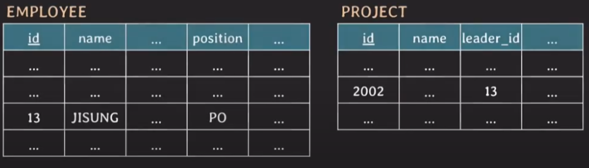
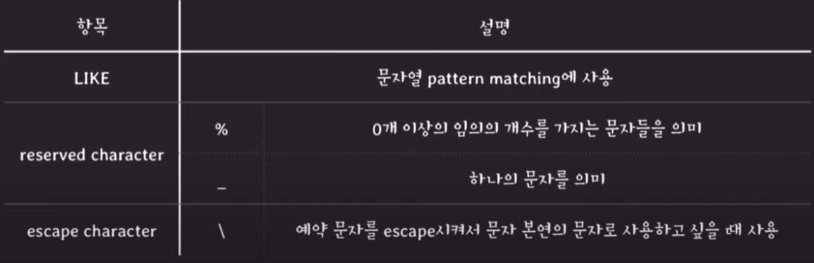

# SQL (DML)

몰랐는데 알게된 것들

- UPDATE 쿼리를 작성할 때 테이블을 여러개 지정할 수 있음.

- 테이블을 여러개 지정했을 때 join condition 으로 연결 가능

- SELECT도 FROM절에 테이블 여러개 지정이 가능하고, join condition으로 연결가능 


## INSERT

### statement

```SQL
INSERT INTO table_name VALUES (comma-separated all values);

INSERT INTO table_name (attributes list) VALUES (comma-separated all values)

INSERT INTO table_name VALUES (... , ..), (... , ..), (... , ..) 
```

## UPDATE

### statement

```SQL
UPDATE table_name(s)

SET attribute = value [, attribute = value, .. ]

[ WHERE condition(s)];
```

### 예제 1. 프로젝트 ID 2003에 참여한 임직원의 연봉을 두배로 인상한다.


```SQL
UPDATE employee, works_on
SET salary = salry * 2
WHERE id = empl_id and proj_id = 2003;
```

- `id = empl_id` 이 부분이 두개의 테이블을 연결시킴

- 서브쿼리를 써야할 줄 알았는데 이게 이렇게 되네?

- 가독성을 높이기 위해 보다 명시적으로 아래와 같이 작성 가능
    ```SQL
    UPDATE employee, works_on
    SET salary = salary * 2
    WHERE employee.id = works_on.empl_id and proj_id = 2003;
    ```

## DELETE

### statement

```SQL
DELETE FROM table_name

[ WHERE condition(s);]
```

## SELECT


### statement

```SQL
SELECT attributes(s)

FROM table(s)

[ WHERE condition(s)];
```

### 예제1. project 2002를 리딩 하고 있는 임직원의 ID 와 이름과 직군을 조회.



```SQL
SELECT employee.id, employee.name, position
FROM project, employee
WHERE project.id = 2002 and project.leader_id = employee.id;
```

- `project.leader_id = employee.id` 조건은 project와 employee를 연결시켜준다.

- 이러한 조건을 join condition이라고 부른다.

## AS

- 테이블에 별칭을 붙일 때 사용. 

- 조회할 attribute에 별칭을 붙일 때 사용

- AS는 생략이 가능하다. 그냥 띄어쓰기만 해도 됨. 

- 그런데 조회할 attribute 별칭에서는 생략안하고, 테이블 별칭에서 자주 생략하는듯?

- ex)
    ```SQL
    SELECT E.id leader_id, E.name leader_name, position
    FROM project P, employee E
    WHERE P.id = 2002 and P.leader_id = E.id;
    ```

## DISTINCT

SELECT 결과에서 중복되는 tuples은 제외하고 싶을 때 사용

## LIKE



## *(asterisk)

선택된 tuples의 모든 attribute를 보여주고 싶을 때 사용


## TMI

SELECT로 조회할 때, WHERE문 조건을 포함해서 조회하는 경우

**조건과 관련된 atrributes에 반드시 index가 걸려있어야 한다.**


