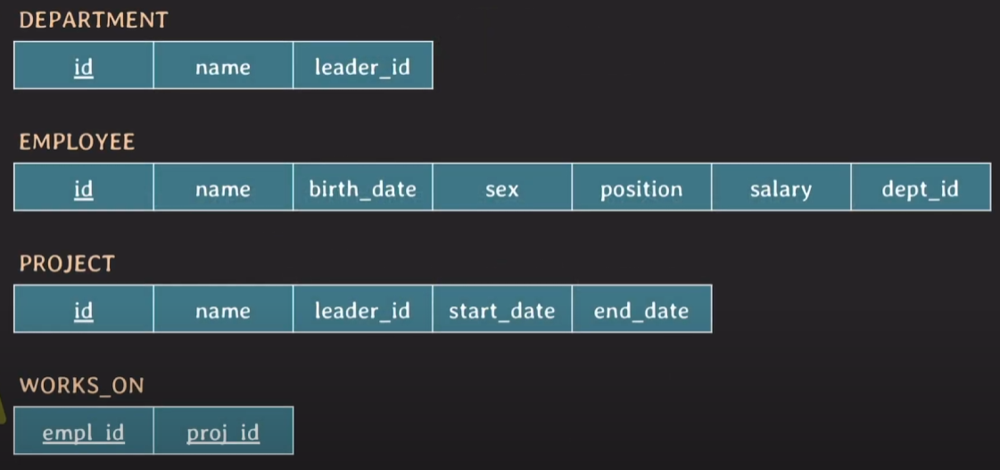

# SQL (subquery)

서브쿼리 : SELECT, INSERT, UPDATE, DELETE에 포함된 query. (  ) 안에 기술

서브쿼리는 보통 SELECT문을 사용하고, **해당 서브쿼리의 결과에 대해 메인쿼리가 수행**되는 방식

서브쿼리의 결과를 가상의 테이블과 같이 FROM 절에도 사용할 수 있음

마찬가지로 SELECT 절과 WHERE 절에도 사용가능하다.

## 예제 (연습)

아래와 같은 스키마가 있을 때 예제를 보면서 서브쿼리를 연습해보자.

복잡해지니까 어렵네.. ㄷㄷ



### 예제1 : ID가 14인 임직원보다 생일이 빠른 임직원의 ID, 이름, 생일을 조회

1. ID가 14인 임직원의 생일을 구하기

```SQL
SELECT birth_date FROM employee WHERE id = 14;
```

2. 그 생일보다 빠른 임직원의 ID, 이름, 생일 구하기.

```SQL
SELECT id, name, birth_date FROM employee
WHERE birth_date < (
SELECT birth_date FROM employee WHERE id = 14;
);
```

### 예제2 : ID가 1인 임직원과 같은 부서 같은 성별인 임직원들의 ID, 이름, 직군 조회

```SQL
SELECT id, name, position
FROM employee 
WHERE (dept_id, sex) = (
    SELECT dept_id, sex
    FROM employee
    WHERE id = 1;
);
```

### 예제3 : ID가 5인 임직원과 같은 프로젝트에 참여한 임직원들의 ID 조회

```SQL
SELECT DISTINCT empl_id FROM works_on
WHERE empl_id != 5 AND proj_id IN (
    SELECT proj_id FROM works_on WHERE empl_id = 5
);
```

### 예제4 : ID가 7 혹은 12인 임직원이 참여한 프로젝트의 ID와 이름 조회

- EXISTS 사용

- EXISTS 는 subquery의 결과가 최소 하나의 row라도 있다면 TRUE를 반환한다.

```SQL
SELECT P.id, P.name
FROM project P
WHERE EXISTS(
    SELECT *
    FROM works_on W
    WHERE W.proj_id = P.id AND W.empl_id IN (7, 12)
);
```

- `W.proj_id = P.id` 이부분이 좀 많이 헷갈리는데, 

    - P.id에 대한 값을 하나씩 대입해서 전부 대입한다라고 생각해보자.
    
    - ex)P.id가 1일 때, 그게 W.proj_id에도 존재하고, W.empl_id 가 7,12중 하나라면 TRUE가 반환된다.

    - 그러면 P.id가 1인 row의 id와 name을 조회하게 된다.
 

- 아래와 같이 나타낼 수도 있다. 

```SQL
SELECT P.id, P.name
FROM project P
WHERE id IN (
    SELECT W.proj_id
    FROM works_on W
    WHERE W.empl_id IN (7, 12)
);
```

### 에제5. : 2000년대 생이 없는 부서의 ID와 이름을 조회

```SQL
SELECT D.id, D.name
FROM department AS D
WHERE NOT EXSISTS (
    SELECT *
    FROM employee E
    WHERE E.dept_id = D.id AND E.birth_date >= '2000-01-01'
);
```

```SQL
SELECT D.id, D>name
FROM department AS D
WHERE D.id NOT IN (
    SELECT E.dept_id
    FROM employee E
    WHERE E.birth_date >= '2000-01-01'
)
```

- 대체적으로 EXISTS로 표현되는건 IN으로도 표현할 수 있다.

### 예제6. : 리더보다 높은 연봉을 받는 부서원을 가진 리더의 ID, 이름, 연봉 조회

- ANY 사용

    - v comparison_operator ANY

    - subquery가 반환한 결과들 중에 단 하나라도 v와의 비교연산이 TRUE라면 TRUE 반환

- SOME도 ANY와 같은 역할을 한다.


```SQL
SELECT E.id, E.name, E.salary
FROM department D, employee E
WHERE D.leader_id = E.id AND E.salary < ANY (
    SELECT salary
    FROM employee
    WHERE id <> D.leader_id AND dept_id = E.dept_id 
);
```

### 예제7. : 리더보다 높은 연봉을 받는 부서원을 가진 리더의 ID, 이름, 연봉, 해당 부서의 최고 연봉 조회

```SQL
SELECT E.id, E.name, E.salary, (
    SELECT max(salary)
    FROM employee
    WHERE dept_id = E.dept_id
) AS dept_max_salary
FROM department D, employee E
WHERE D.leader_id = E.id AND E.salary < ANY (
    SELECT salary
    FROM employee
    WHERE id <> D.leader_id AND dept_id = E.dept_id 
);
```
### 예제8. ID가 13인 임직원과 한번도 같은 프로젝트에 참여하지 못한 임직원들의 ID, 이름, 직군 조회

- ALL 사용

    - v comparison_operator ALL subquery

    - subquery 반환 결과와 v와의 비교 연산이 모두 TRUE라면 TRUE 반환 

- 이거 NOT IN으로도 대체가능할 것 같은데

```SQL
SELECT DISTINCT E.id, E.name, E.position
FROM employee E, works_on W
WHERE E.id = W.empl_id AND W.proj_id <> ALL (
    SELECT proj_id
    FROM works_on
    WHERE empl_id = 13
);
```
