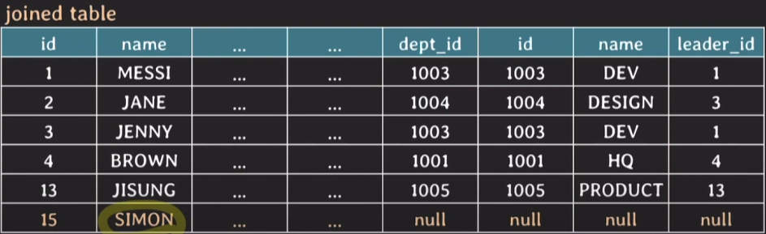
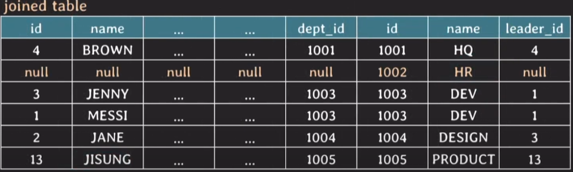
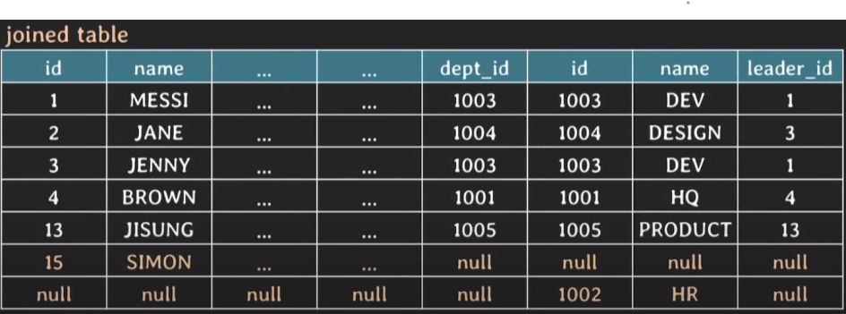

# 2. SQL(JOIN)

### JOIN

- 두개 이상의 테이블을 한번에 조회하는 것

- join condition을 통해 이루어짐.

- join condition에는 =, <, >, != 등 여러 비교연산자가 사용 가능하다.

## 암묵적 조인 vs 명시적 조인 

### 암묵적조인

- FROM 절에는 테이블만 나열하고 WHERE절에 join condition이 있음

- 가독성도 떨어지고, 실수하기도 쉬워서 잘 안씀

- 예시

    ```SQL
    SELECT D.name
    FROM employee AS E, department AS D
    WHERE E.id = 1 and E.dept_id = D.id;
    ```

### 명시적 조인

- FROM절에 JOIN 키워드와 함께 조인 테이블을 명시

- FROM절에서 ON 뒤에 join condition이 명시된다.

- 가독성도 좋고 실수할 가능성도 적다

- 예시
    ```SQL
        SELECT D.name
        FROM employee AS E 
        JOIN department AS D ON E.dept_id = D.id
        WHERE E.id = 1;
    ```


## INNER JOIN

- 그냥 **JOIN을 쓰면 INNER JOIN이 생략된 것**이다.

- 두 테이블에서 join condition을 만족하는(true) tuple들로만 result table을 만듬

- 즉 join condition의 결과가 unknown이면 result table에 포함을 시키지 않음.

### 예시


```SQL
SELECT *
FROM employee E INNER JOIN department D
ON E.dept_id = D.id;
```

- 위의 상황에서 Inner Join 의 경우에는 SIMON에 대한 튜플을 제외시킨다.

- 그리고 HR부서에 대한 튜플도 제외시킨다.

## OUTER JOIN

- 두 테이블에서 join condition을 만족하지 않는 tuple들도 result table에 포함

- LEFT [OUTER] JOIN, RIGHT [OUTER] JOIN, FULL [OUTER] JOIN 존재

- MySQL 에서는 FULL OUTER JOIN은 존재하지 않음

### LEFT [OUTER] JOIN

- join condition이 만족하지 않더라도, 

  **왼쪽에 있는 테이블의 튜플은 전부 result table에 포함시킴.**

- 여기서 왼쪽이란 JOIN 키워드의 왼쪽에 있는 테이블을 의미한다.

**[ 예시 ]**

```SQL
SELECT *
FROM employee E LEFT OUTER JOIN 
department D ON E.dept_id = D.id;
```



### RIGHT [OUTER] JOIN

- join condition이 만족하지 않더라도, 

  **오른쪽에 있는 테이블의 튜플은 전부 result table에 포함시킴.**

**[ 예시 ]**

```SQL
SELECT *
FROM employee E RIGHT OUTER JOIN 
department D ON E.dept_id = D.id;
```



### FULL [OUTER] JOIN

- join condition을 만족하지 않더라도

  **양쪽에 있는 테이블의 튜플을 모두 result table에 포함시킴**

- MySQL에서는 지원하지 않음

**[ 예시 ]**

```SQL
SELECT *
FROM employee E FULL OUTER JOIN
department D ON E.dept_id = D.id;
```



## USING

두 테이블이 equi join (join condition에서 '='을 사용) 을 할 때, 

attribute의 이름이 같다면 USING으로 간단하게 작성할 수 있다. 

attribute는 하나만 표시된다.

**[ 예시 ]**

```SQL
SELECT *
FROM employee E INNER JOIN department D USING (dept_id);
```

- 이 때 employee 테이블에도 dept_id라는 attribute가 있어야 하고,

  department 테이블에도 dept_id라는 attribute가 있어야 한다.

- USING은 INNER, OUTER 상관없이 모두 사용할 수 있다.

## natural join

- 두 테이블에서 같은 이름을 가지는 모든 attribute pair에 대해 equi join을 수행.

- join condition을 따로 명시하지 않는다.

(이거 근데 쓸일이 있나....???)

## cross join

- 두 테이블의 tuple pair로 만들 수 있는 모든 조합을 result table로 반환 (카르테시안 곱)

- join condition이 없다.

- 암묵적 cross join : FROM table1, table2

- 명시적 cross join : FROM table1 CROSS JOIN table2

- 그러나 MySQL 에서는 cross join = inner join = join 이다. (예외)

    - CROSS JOIN에서 ON을 쓰면 inner join 으로 동작한다.

    - INNER JOIN에서 ON을 사용하지 않으면 cross join으로 동작한다.


## 연습
```
ID가 2001인 프로젝트에 참여한임직원들의

이름과 직군과 소속 부서 이름을 조회
```

```SQL
SELECT E.name, E.position, D.name
FROM employee E
INNER JOIN works_on W ON E.id = W.empl_id
LEFT JOIN department D ON E.dept_id = D.id
WHERE W.proj_id = 2001;
```

- 이때 중요한점은 department와 JOIN할 때 left join을 해주어야 한다.

- 그렇게 해야 부서가 NULL인 임직원도 조회가 가능하다.