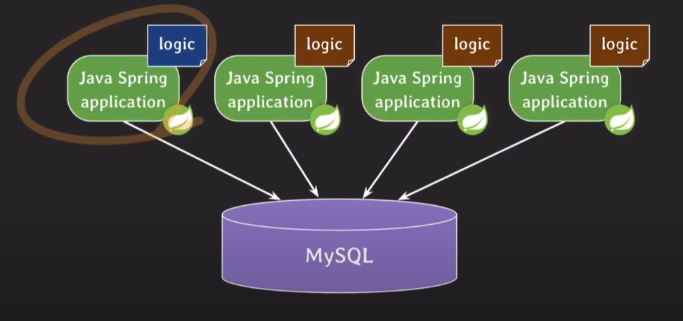

# 3. stored procedure

- 언뜻 보면 stored function과 비슷함

- stored function과 마찬가지로 작성할 때 delmiter를 다른것으로 바꿔주자

- 비즈니스 로직을 구현하는 용도로 사용됨 ...... (좋지 않음)

### 예제 : 두정수의 곱셈 결과를 반환

```SQL
CREATE PROCEDURE product (IN a int, IN b int, OUT result int)
BEGIN
    SET result = a * b;
END
```

- 인풋 파라미터와 아웃풋 파라미터가 구분되어 있다.

- IN은 파라미터를 변경할 수 없다.

- 아무것도 적지않으면 IN으로 취급한다.

### 예제2 : 두 정수를 맞바꾸는 프로시저 작성

```SQL
CCREATE PROCEDURE swap(INOUT a int, INOUT b int)
BEGIN
    set @temp = a;
    set a = b;
    set b = @temp;
END
```

- INOUT 파라미터 사용 (값 전달 및 반환)

### 예제3 : 각 부서별 평균 연봉을 가져오는 프로시저 작성

```SQL
CREATE PROCEDURE get_dept_avg_salary()
BEGIN
    select dept_id, avg(salary)
    from employee
    group by dept_id;
END
```

- stored function과 다르게 조회가 가능

- 값을 반환하지 않는것이 가능

### 예제4 : 닉네임 변경 히스토리를 작성하기

```SQL
CREATE PROCEDURE change_nickname(user_id INT, new nick varchar(30))
BEGIN
    insert into nickname_logs(
        select id, nickname, now() from users where id = user_id
    );
    update users set nickname = new_nick where id = user_id;
END
```

## stored function 과 stroed procedure 차이

**RDBMS 마다 조금씩 다를 수 있음**

실제로 사용한다면 해당 RDBMS에 맞춰서 문서를 참고해야함.


## stored procedure의 장점

### application에 transparent 하다

WAS의 비즈니스 로직을 변경하고, 다시 배포를 하는 상황을 생각해보자

이 때, 무중단 배포를 하기 위해서는 한번에 모든 서버에 배포할 수 없다.

완전한 블루 그린 배포를 사용한다면 해결이 되겠지만 인프라 리소스가 부담된다.





(이러한 배포 방식을 롤링 배포 라고 하는것 같다)

위와 같은 인프라 구조일 때 stored procedure를 사용한다면,

그냥 DB의 프로시저만 수정하면 WAS는 수정없이 해결될 수 있다.

(이렇게 수정없이 해결되는것을 'transparent'하다고 함)

### network 트래픽을 줄여서 응답속도를 향상시킬 수 있다.

- DB와 WAS 사이의 네트워크 트래픽이 줄어든다.

### 여러 서비스에서 재사용 가능하다.


- 위와 같이 여러 서비스에서 하나의 DB서버에 접근해야 하는경우

  WAS마다 코드를 중복작성할 필요없이 stored procedure를 재사용할 수 있다.

### 민감한 정보에 대한 접근을 제한할 수 있다.

- 개발할 때, 개발자가 직접적으로 database에 접근하지 않고,

  stored procedure를 통해 간접적으로 개발하도록 함

## stored procedure의 단점. 안쓰는 이유

### 유지보수 비용이 커진다.

- 비즈니스 로직이 산재되어 있다.

- 소스코드의 버전관리, 프로시저의 버전관리 둘다 해줘야한다.

- 개발자가 프로시저의 문법에 대해서도 추가로 알아야한다.

- 기능 추가를 할 때, 프로시저를 추가한다면? WAS와 DB 둘다 변경해야한다.

### DB 서버를 추가하는 것은 간단한 작업이 아니다

- 트래픽이 몰렸을 때 WAS를 추가하는것은 상대적으로 쉽다.

- 그러나 DB서버는 어렵다. DB안의 데이터를 복제해야하기 때문

- 그래서 DB에는 최대한 부하를 주지말고, WAS에 부하를 주는것이 좋다.

- 따라서 WAS가 비즈니스 로직의 부하를 감당하는 편이 낫다.

  (stored procedure를 사용하면 DB에 부하가 커진다.)

### stored procedure가 언제나 transparent하지 않다.

- stored procedure의 이름을 변경한다면?

- WAS도 변경해야한다.

- 오히려 손이더 많이갈때가 있다.

### 배포할 때, 버그 발생시 모든 WAS가 영향을 받는다.

- 일부 WAS에만 새로운 버전을 배포할 수 있음 (카나리아 배포, 안정성을 모니터링하는 용도)

    - 모니터링하다 버그가 발생되면 해당 서버만 롤백하면 된다.

- 반면 stored procedure에 버그가 발생하면 버그의 영향이 온 WAS에 퍼진다.

### 로직 재사용은 사실 양날의 검이다.

- WAWS A에서 트래픽이 몰려서 DB가 마비된다면? service B, C도 영향을 받는다.

- 따라서 아래와 같이 아키텍처를 가져가는 것이 좋다.

  

- restAPI를 지원하는 data service를 두고, 

  service A에 트래픽이 심하게 몰리면 A를 끊으면 된다.

- 그리고 이렇게 하면 로직재사용도 확보할 수 있다.

- 그런데 이거 인바운드규칙으로 끊어낼 수 있지 않나?


### 비즈니스 로직을 소스 코드에 두고도 응답속도를 향상 시킬 수 있다.

- 만약에 insert와 update를 동시에해도 문제가 되지 않는 로직이라면?

  

  - 비동기적으로 DB에 요청을 보내면 된다.
  
- redis와 같은 캐시 사용하면 네트워크 비용도 더 줄어들 수 있다.

### stored procedure가 민감한 정보에 대한 접근을 완벽히 제한할 수 없다.

- 개발자가 마음먹고 접근하려고 하면 접근가능하다.

- 그리고 이렇게 테이블접근을 막으면 개발 및 CS 업무의 신속함도 떨어진다.

- 따라서 보안관련해서는 아래와 같은 방법을 선택하는게 좋다고 한다.

  - 담당자나 개발자에게 DB 및 테이블 권한 부여

  - 민감한 정보는 암호화 저장

  - 보안서약서를 통해 정책적으로 보안강화

### 이외의 단점

- procedure로는 복잡하고 유연한코드는 작성이 힘듬 (프로그래밍 언어가 훨씬 더 강력)

- 가독성도 떨어지고 디버깅도 어렵다.

## 느낀점

stored procedure의 장단점을 공부하면서 아키텍처적 인사이트를 얻어갈 수 있어서 좋았다.

+ 실무의 인사이트를 배운 것 같아서 좋았다. 정말 유익했다

https://www.youtube.com/watch?v=SOLm-GXFzG8&list=PLcXyemr8ZeoREWGhhZi5FZs6cvymjIBVe&index=12


