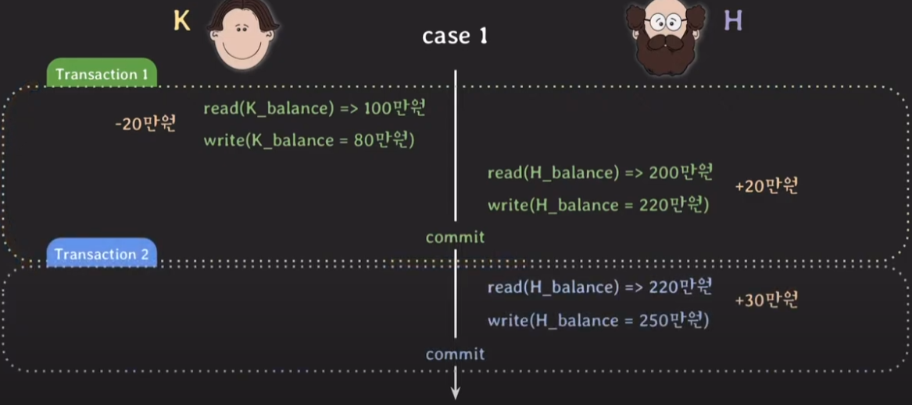
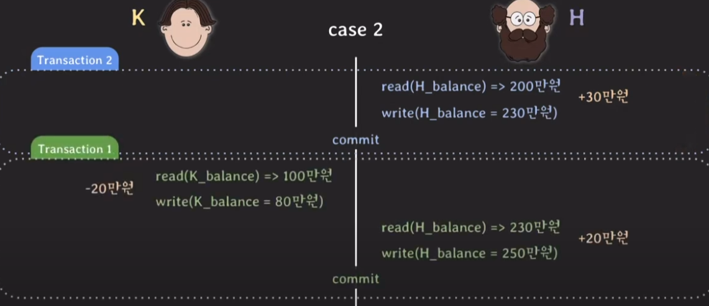
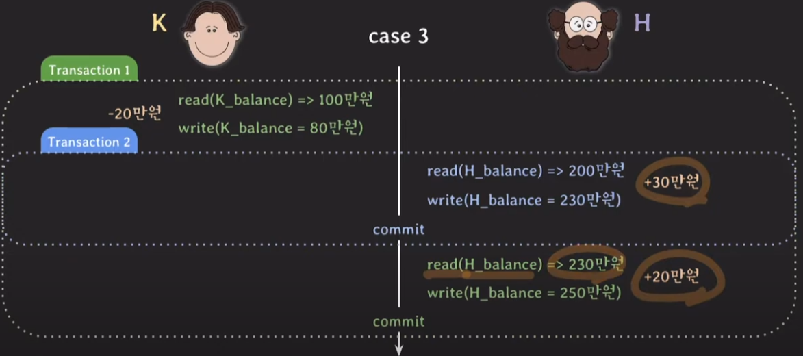
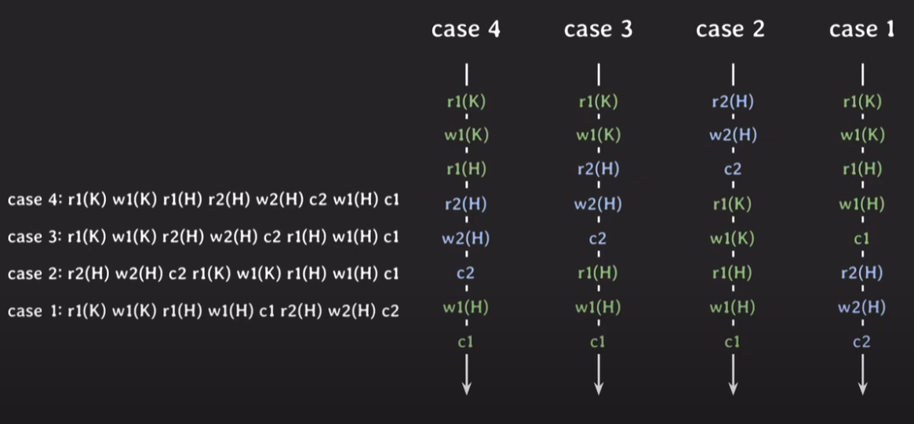
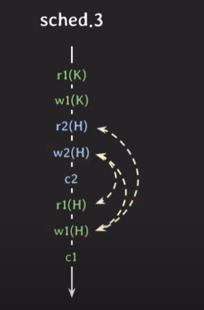
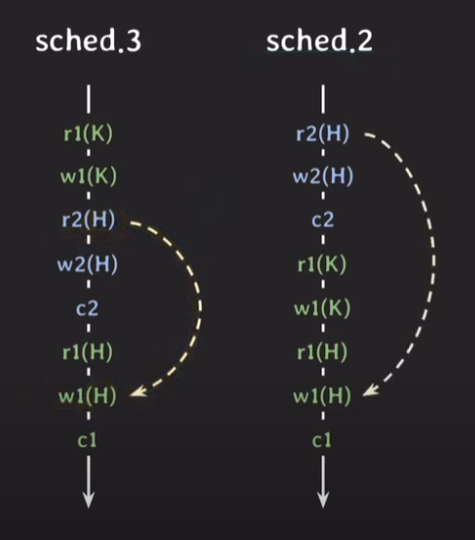
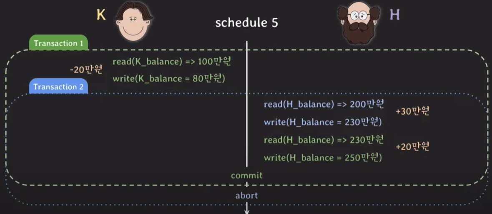
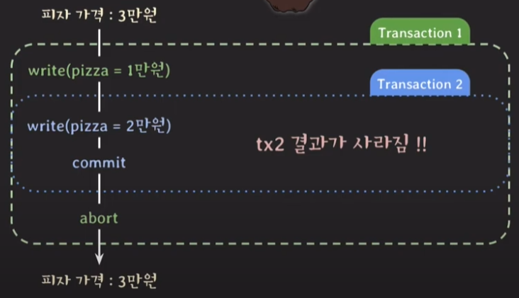
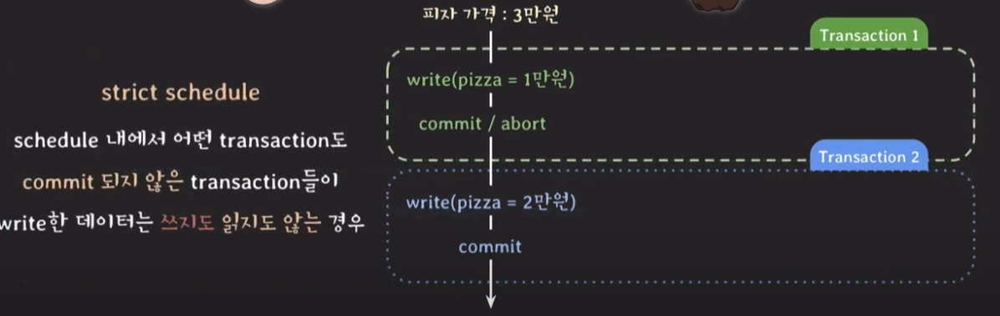
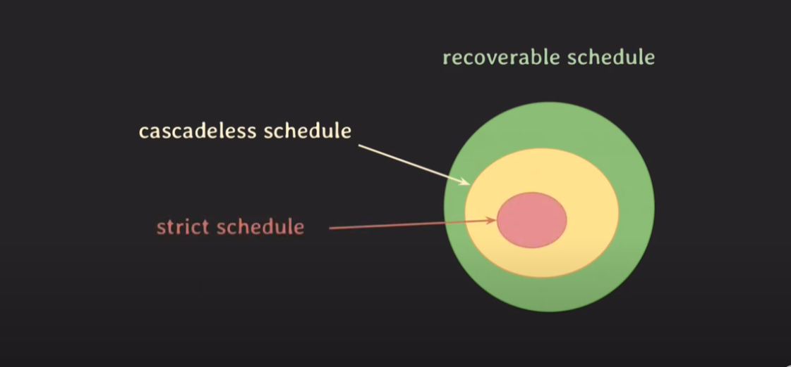

# 4-2 concurrency control 기초

concurrency control은 serializability와 recoverability를 제공한다. (isolation)

# 1.Serializability 

## 상황

현재 K는 잔고에 100만원이 있고, H는 잔고에 200만원이 있다.

아래와 같은 상황이 동시에 일어난다고 생각을 해보자

- K가 H에게 20만원을 이체(송금)    ----- transaction 1

- H도 ATM에서 30만원 입금         ----- transaction 2

위의 상황이 종료되었을 떄,

K의 잔고가 80만원이 남아있고, H의 잔고가 250만원 남아있어야 정상적인 상황이다.

### CASE1 (정상)

### CASE2 (정상)

### CASE3 (정상)

### CASE4 (비정상:LOST UPDATE)

## 실행순서 간략화 (Schedule)

위의 각 CASE는 아래와 같이 간략화해서 표현이 가능하다.

### 용어 정리

- operation 

    - 각각의 read, write, commit 등의 연산

- schedule

    - 여러 transaction이 동시에 실행될 때 각 transaction에 속한 opration의 실행순서

    - **각 transaction 내의 operations들의 순서는 바뀌지 않는다.** (당연)

- serial schedule 

    - transaction들이 겹치지않고 한번에 하나씩 실행되는 schedule

    - 위의 경우 case1과 case2는 serial schedule에 속한다.

    - I/O작업중에 CPU가 놀고있어서 성능적으로 좋지 않다. 현실적으로 사용불가능하다.

    - 하지만 잘못된 결과가 나올 걱정은 없다.

- nonserial schedule

    - transaction들이 겹쳐서(interleaving) 실행되는 schedule

    - 위의 경우 case3과 case4는 nonserial schedule에 속한다.

    - serial schedule보다 성능적으로 좋다. 
    
    - **하지만 어떤형태로 겹쳐서 실행되느냐에 따라서 잘못된 결과가 나올 수 있다.** (CASE4)

### 문제 상황

- serial schedule은 성능적으로 너무 느려서 nonserial schedule을 사용하고 싶음.

- 하지만 nonserial schedule은 transaction이 어떤형태로 겹쳐지냐에 따라 잘못된 결과가 나옴 (CASE4)

- 그런데 꼭 그런건 아니고 결과가 정상적으로 잘 나올수도 있음 (CASE3)

- nonserial schedule을 채택하되, CASE3에 관한 경우만 걸러내면 좋을톈데 ....

## Conflict 

아래의 3가지 조건을 만족하면 conflict이다.

1. 서로 다른 transaction 소속

2. 같은 데이터 접근

3. 최소 하나는 write operation

(여기서 2,3의 경우 꼭 DB에 국한되지 않고 일어날 수 있는 동시성 문제 상황의 조건이다.)

위의 경우에는 3가지 conflict가 존재한다.

**중요한 것은 conflict operation의 순서가 바뀌면 결과가 바뀌게된다는 점이다.**

위의 예제에서 녹색 트랜잭션이 read해온 값이 각각 다르다

왼쪽의 경우에는 230이고, 오른쪽의 경우에는 200이다.

이 상황에서 녹색 트랜잭션의 read값이 이어지는 operation에 영향을 미치면 

위의 CASE3과 CASE4처럼 다른 결과가 나오게 된다.

## Conflict Equivalent, Conflict Serializable

두 조건을 모두 만족하면 conflict equivalent 하다.

1. 두 schedule 모두 같은 transaction을 가진다.

2. 어떤 conflict operations의 순서도 양쪽이 동일하다.

CASE2와 CASE3의 경우를 보자.

위의 화살표 된 conflict operations은 동일하다.

그리고 이외의 conflict operations의 순서도 동일하다. 

따라서 이경우 sched2와 sched3은 Conflict Equivalent하다고 할 수 있다.

(View Equivalent, View Serializable 이라고도 함)

**[ 중요 ]**

sched3은 sched2와 conflict equivalent 하다. 

이 말은 모든 conflict operation의 순서가 같다는 것이고, 

sched2와 sched3은 같은 결과가 나온다는 말과 같다. 

그런데 여기서 sched2는 serial schedule이기 때문에

sched3은 정상적인 결과가 나오게된다.

**그리고 이와같이 serial schedule과 conflict equivalent 할 때 conflict serializable 하다고 말한다.**

## 결론 (위의 문제 해결 방법)

- conflict serializable한 non-serializable schedule을 허용하자!!

- 여러 transaction을 동시에 실행해도 schedule이 conflict serializable하도록 보장하는 protocol 적용

    - 모든 serializable-schedule을 찾고, 
    
      이와 비교해서 conflict serializable한지 찾을 수도 있지만 이렇게는 안하는듯...

- 자세한 구현에대한 내용은 나중에...

---

# 2. Recoverability

## 상황

- tx1이 commit되었고, tx2가 문제가 있어서 rollback 되었음.

- 그런데 tx1은 tx2가 write한 값을 읽고 있음.

- 이 상황에서 데이터 무결성을 지키기 위해선 tx1도 같이 rollback 해주어야함.

- 그런데 tx1은 이미 커밋된 상태이므로 durability(ACID)에 의해 rollback을 하면 안됨

## unrecoverable schedule

위의 경우와 같이

schedule 내에서 **commit된 transaction이 rollback된 transaction이 write 했던 데이터를 읽은 경우**

**unrecoverable schedule**이라고 한다.

**그리고 이와 같은 schedule은 애초에 DBMS가 허용하면 안 된다.**

## recoverable schedule

왜 unrecoverable schedule이 발생했는지 위의 상황을 잘 살펴보자.

문제가 되는 지점은 tx1이 tx2가 변경한 값을 읽어오는 것이다. (tx1이 tx2에 의존)

그런데 이 상황에서 **tx1은 tx2가 문제가 있는지 없는지도 모르는채 먼저 커밋을 해버린다.** 

따라서 되돌릴 수가 없는것이다. (unrecoverable)

여기서 tx2가 먼저 커밋이 되면 어떨까. 

tx2가 문제가있어서 롤백하더라도 tx1이 커밋이 안된 상태이기에 마저 tx1을 롤백시켜주면 된다. (recoverable)

**이처럼 자신이 읽은 데이터를 write한 transaction이 commit/rollback 전까지는 commit 하지 않는 경우를**

**recoverable schedule** 이라고 한다. 그리고 DBMS는 이런 recoverable schedule만 허용해야 한다.

### cascading rollback / cascadless schedule(avoid cascade rollback)

하나의 tx가 rollback이 되면 의존성 있는 다른 tx도 rollback 해야 한다. 

이를 cascading rollback 이라고 한다.

그런데 cascading rollback은 비용이 많이 발생한다.

이 문제 때문에 

**데이터를 write한 transaction이 commit/rollback 한 뒤에 데이터를 읽는 schedule만 허용한다.**

(update lock?)

 

그리고 이처럼 Schedule 내에서 어떤 tx도 **commit되지 않은 write한 데이터를 읽지 못하게 하는 경우**를

cascadless schedule(avoid cascade rollback) 라고 한다. 

## Strict Schedule

위에서 살펴본 cascadless schedule(avoid cascade rollback)도 문제가 발생할 수 있다.

cascadless schedule을 적용한다면 위와같은 예제를 대처할 수 없다.

tx1이 문제가 생겨서 tx1이전으로 롤백을 하게 되면 tx2결과가 지워지게 된다.

이러한 문제가 발생하는 이유는 cascadless schedule이 read에 있어서만 제약을 걸기 때문이다.

이렇게 하면 위의 예제처럼 write / write가 발생하는 경우를 대처할 수 없다. 

결국 이문제를 해결하기 위해서는 

schedule 내에서 어떤 tx도 **commit되지 않은 tx들이 write한 데이터는 쓰지 않고, 읽지도 않아야 한다.**

그리고 이와 같은 schedule을 Strict Schedule 이라고 한다.

## Diagram

