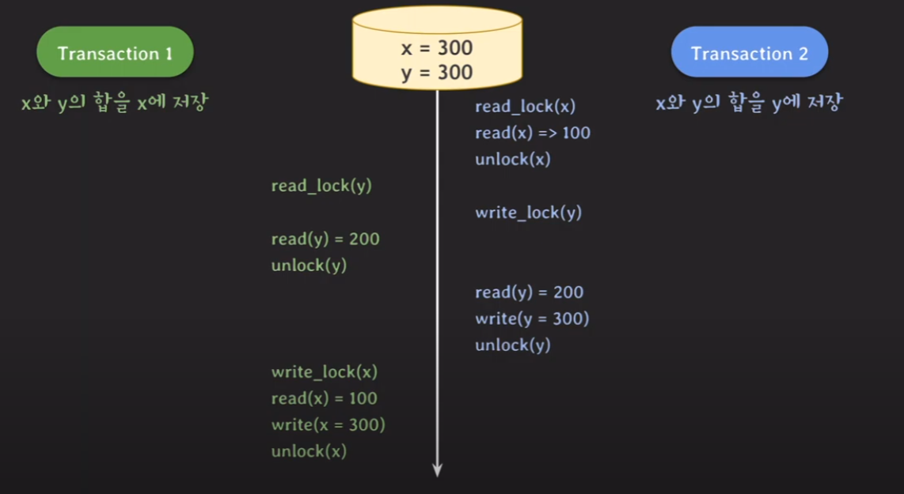
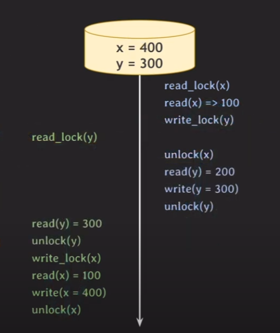
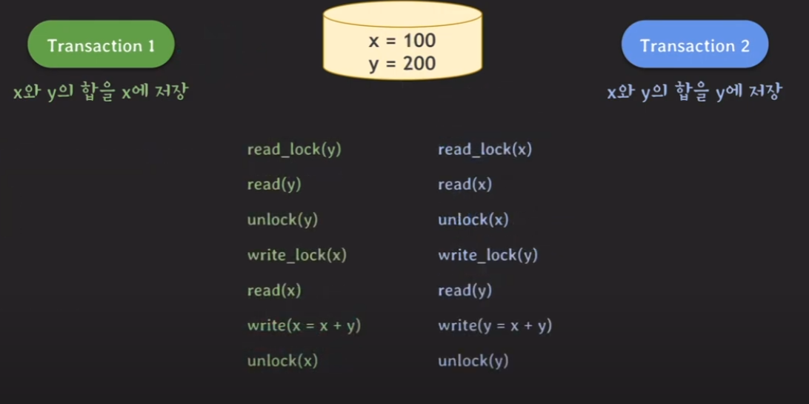
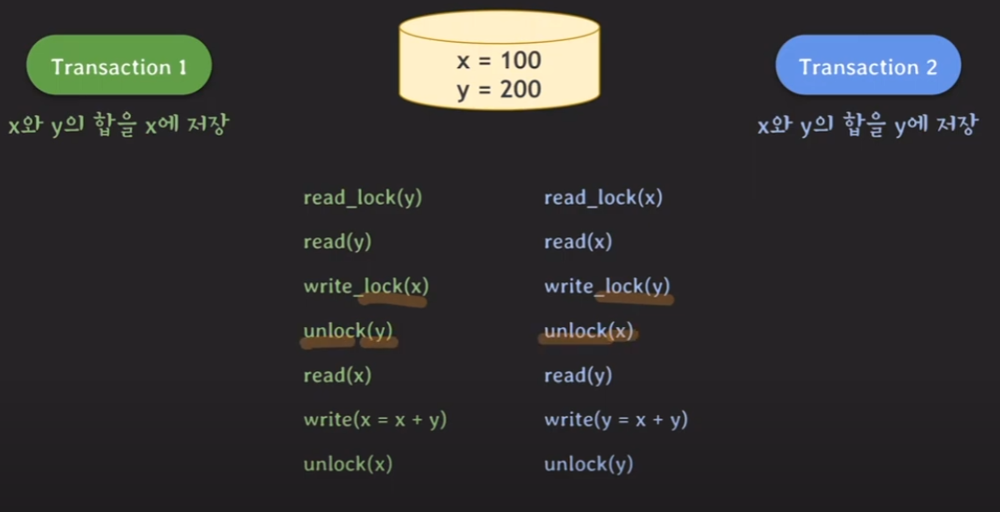
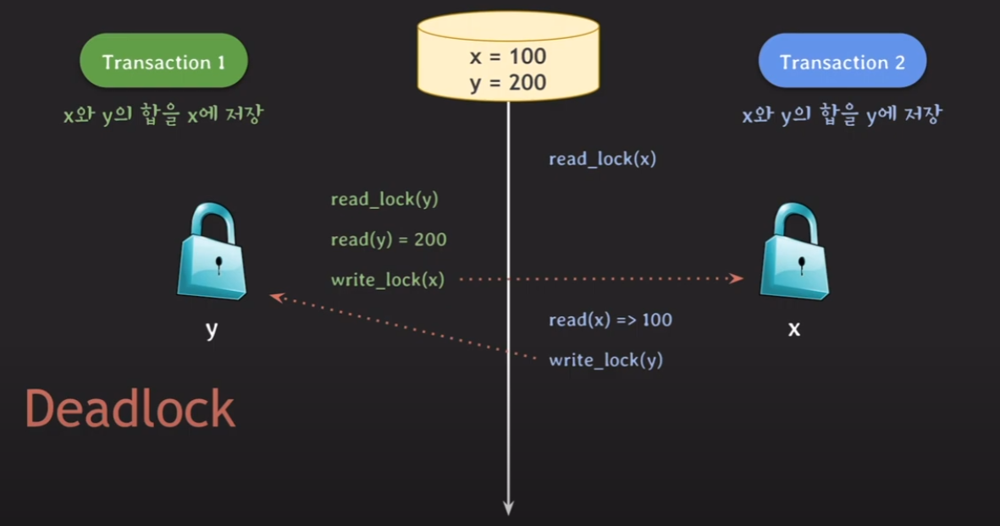
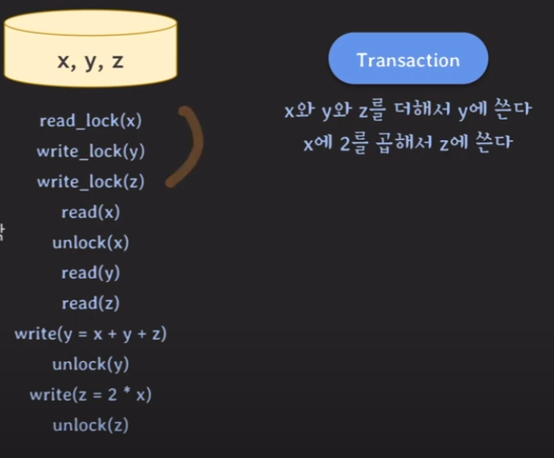
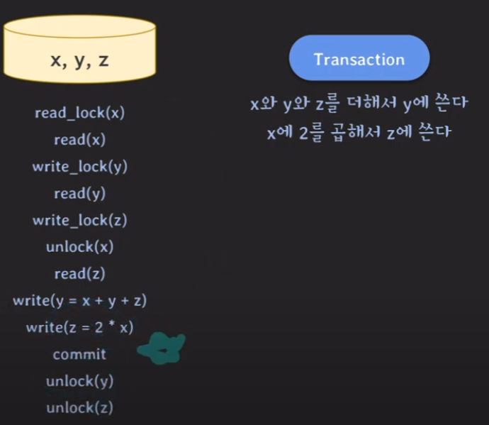
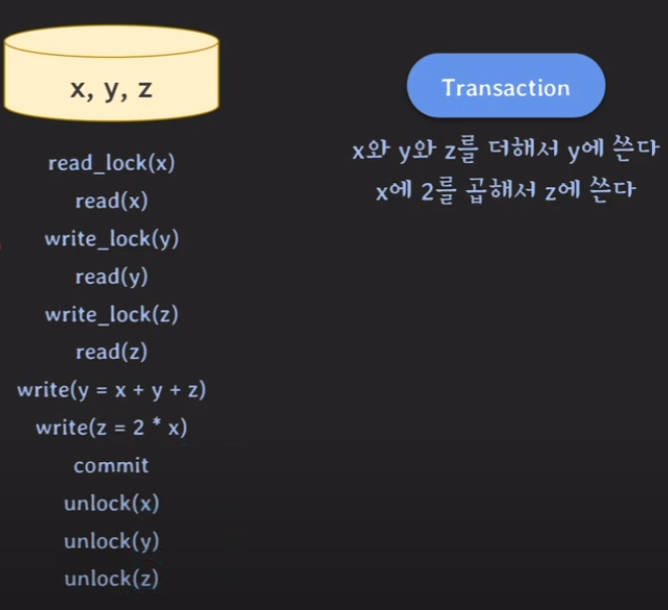

# 락과 동시성제어(2PL protocol)

## Write Lock / Read Lock

- Write-Lock (exclusive lock, 쓰기락)

    - read / write 할 때 사용한다. 

    - 다른 tx이 데이터를 read / write 하는것을 허용하지 않는다.
      **(exclusive함)**

- Read-Lock (shared lock, 읽기락)

    - read할 때 사용된다.

    - 다른 tx이 같은 데이터를 read 하는것을 허용한다.
      (write는 비허용)

## Lock의 호환성

|            | Read Lock   | Write Lock |
|------------|-------------|------------|
| Read Lock  | 호환 가능    | 호환 불가능 |
| Write Lock | 호환 불가능  | 호환 불가능 |

## Lock을 써도 이상현상이 발생할 수 있다.

정상 결과 1 : tx1 -> tx2 (serial)   x : 300 , y : 500

졍상 결과 2 : tx2 -> tx1 (serial)   x : 400 , y : 300  

### 이상현상 예제

[문제가 발생하는 지점]

- tx1은 x값을 변경, tx2는 y값을 변경한다. 

    - serial하게 진행된다면 두 tx중 하나는 또 다른 tx에 의해 변경된 값(x or y)을 반영해야 한다.

- 그런데 위의 예제의 경우 ... 

    - tx2는 처음에 수정되기 전의 x를 읽음.

    - tx1도 수정되기 전의 y를 읽음.

- 아래와 같은순서로 변경되면 이상현상이 발생하지 않음. 

- write_lock(y)이 수행되면서 tx1이 블락이 되버림.

## 해결방법

- 락을 거는 phase하고 락을 해제하는 phase를 구분한다.

- 락을 먼저 전부 걸고, 그 다음에 락을 해제한다.

### 이상현상이 발생하는 operation 순서

### 이상현상이 해결된 operation 순서

## 2PL Protocol (Two-Phase Locking)

위의 해결방법과 같이 락을 취득하는 Phase 하고, 

lock을 반환하는 phase를 구분하는 것을 2PL 프로토콜 이라고 한다. 

**2PL 프로토콜에서는 모든 locking operation이 최초의 unlokcing operation보다 먼저 수행된다.**

그러나 deadlock이 발생할 수 있다.

### 2PL에서 발생하는 데드락 예제

## 2PL의 종류 및 특징

### Conservative 2PL

- 모든 lock을 취득한 뒤 transaction 시작

- deadlock-free

- 실용적이진 않음. 
  (모든 락을 취득하려면고 시작하려면 오히려 트랜잭션을 시작하기가 어려워짐)

### Strict 2PL

- strict schedule을 보장하는 2PL 

    - strict schedule 
    
    - 커밋되지 않은 데이터는 읽지도 않고 쓰지도 않음. 
    
    - write-write의 경우에도 recoverability 보장

- recoverability 보장

- write-lock을 commit / rollback 될 때 반환

### Strong Strict 2PL

- strict schedule을 보장하는 2PL

- recoverability 보장

- read-lock write-lock 모두 commit/rollback 될 때 반환

- S2PL보다 구현은 쉽지만 read-lock을 오래 점유하고 있음.

## 2PL 방식의 단점

|            | Read Lock   | Write Lock |
|------------|-------------|------------|
| Read Lock  | 호환 가능    | 호환 불가능 |
| Write Lock | 호환 불가능  | 호환 불가능 |

read-read를 제외하고는 한쪽이 block이 되므로, 전체 처리량이 좋지 않다.

이 문제를 해결하기 위해 최근의 RDBMS에서는 MVCC방식을 사용함.