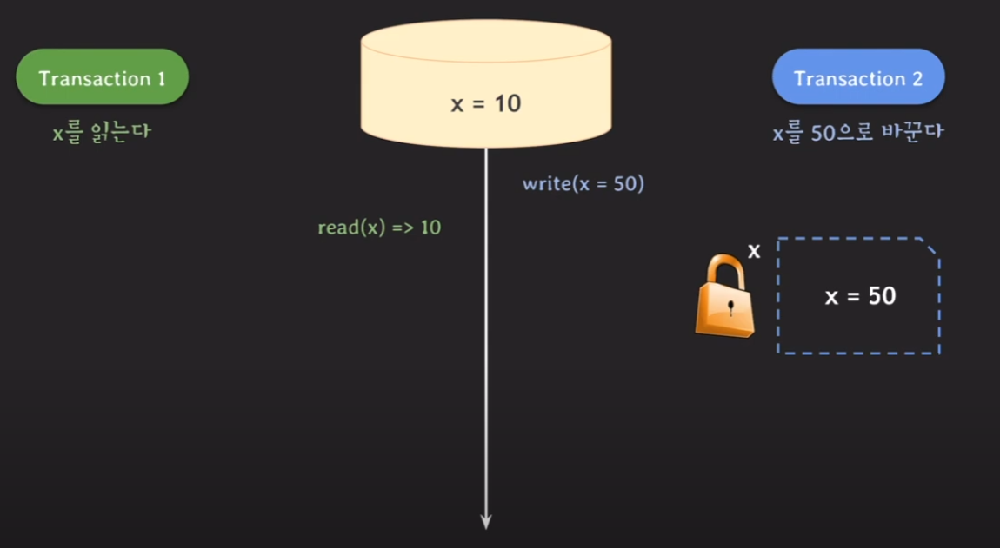
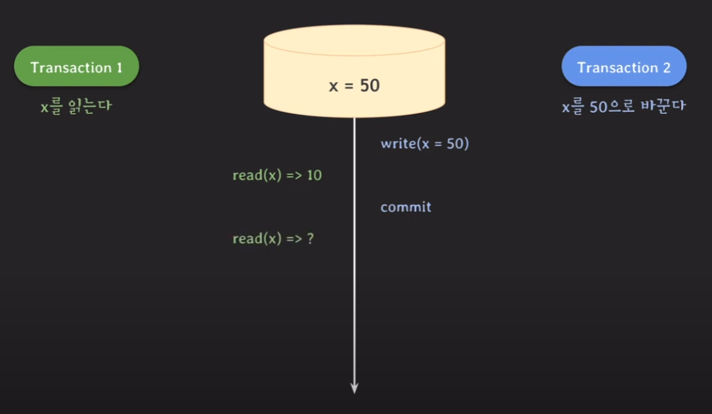
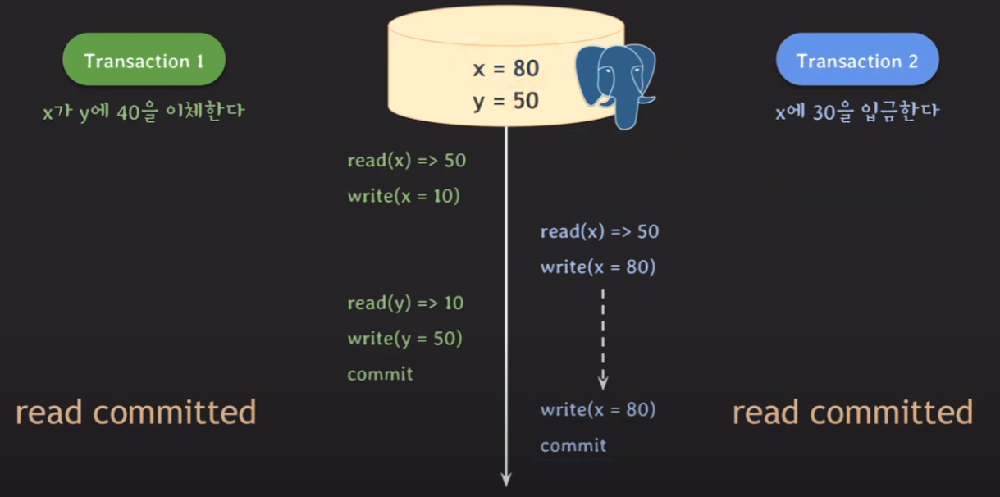
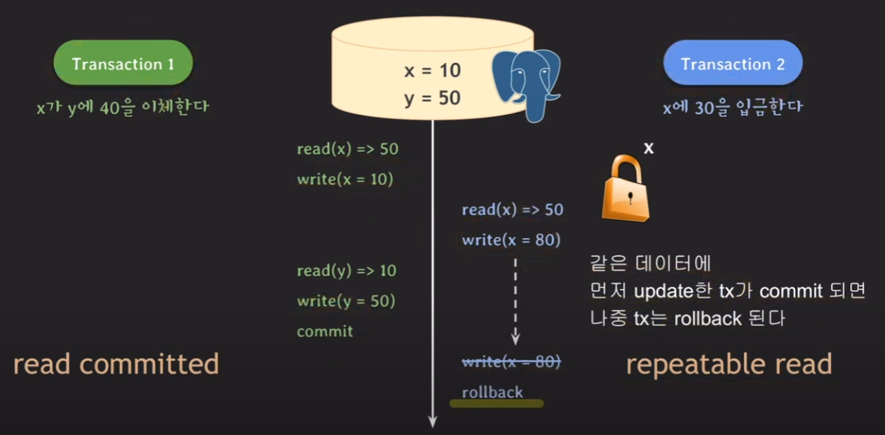
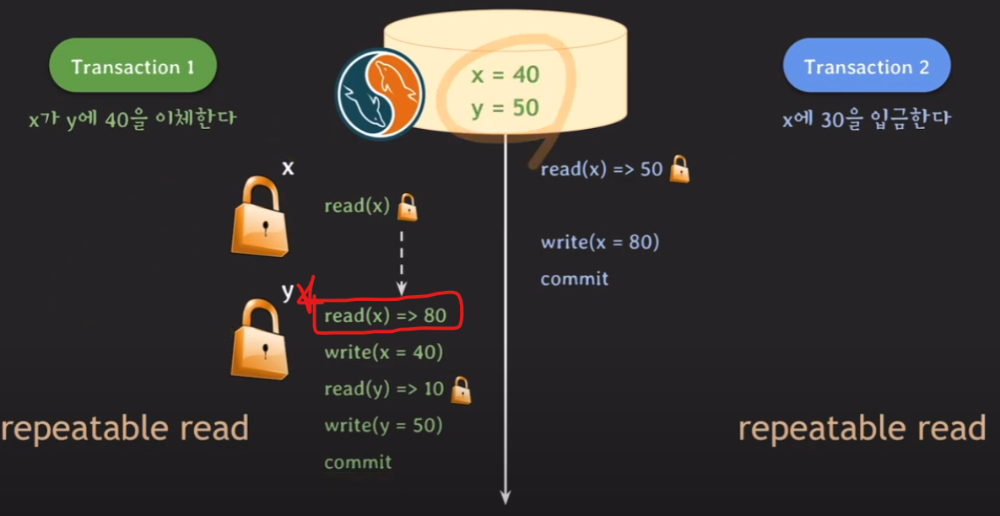
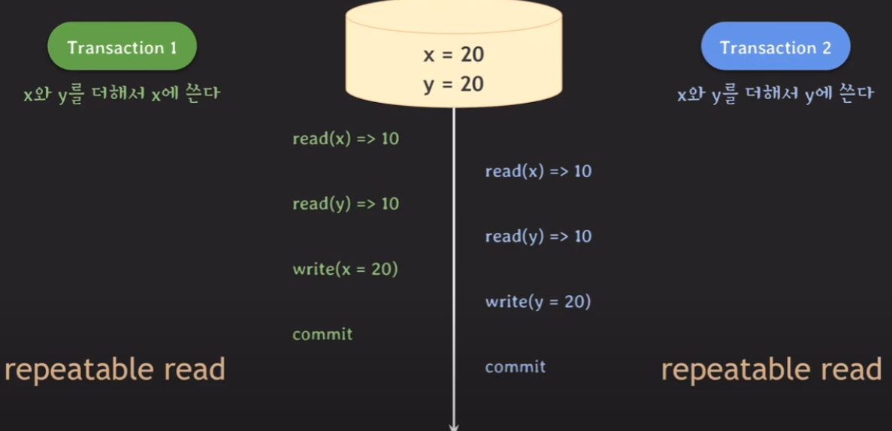
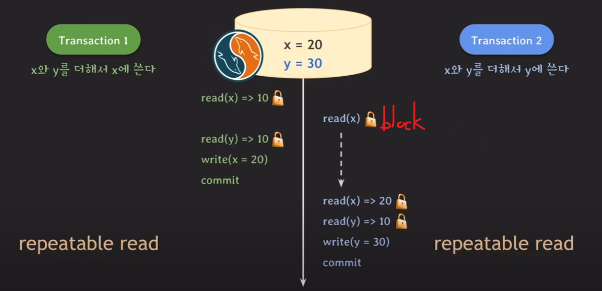
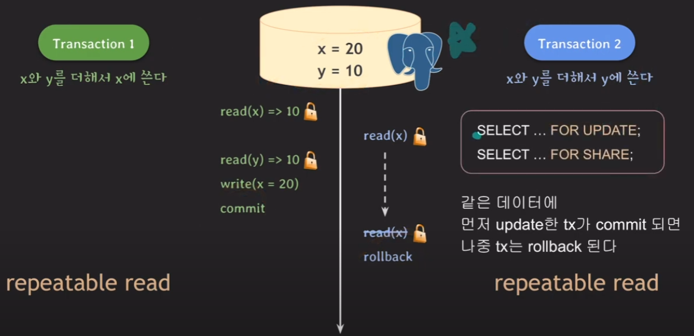

# MVCC와 동시성 제어

MVCC 예제에 대한 가정

- unlock 과정은 commit 이후에 진행 됨 (Recoverability를 위해서)

- 쓰기를 할 때 write락은 사용하지만, 읽기를 할 때 read락은 사용하지 않음 

## Lock-Based Concurrency Control

|            | Read Lock   | Write Lock |
|------------|-------------|------------|
| Read Lock  | 호환 가능    | 호환 불가능 |
| Write Lock | 호환 불가능  | 호환 불가능 |

## MVCC Concurrency Control

|            | Read Lock   | Write Lock |
|------------|-------------|------------|
| Read Lock  | 호환 가능    | 호환 가능   |
| Write Lock | 호환 가능    | 호환 불가능 |

## MVC 예제

- tx2가 write락을 걸고, x의 값을 50으로 변경함

    - 그런데 **이것을 tx2 고유공간에 x = 50으로 변경함.** 

- tx1이 x값을 읽는다.

    - **mvcc는 값을 읽을 때 commit된 데이터만 읽음**. 따라서 write lock인데도 read가 가능

    - 즉 x=50을 읽는것이 아니라, x=10으로 읽음.

    - 대신 이렇게 하려면 해당 데이터에 대한 스냅샷이 필요함.

- 이후에 tx1이 x를 한번 더 읽는다면 어떤값을 가져오는가?

  **이것은 isolation 레벨에 따라 다르다.**

- read commitied 

    - **read 하는 시간 기준으로 그전에 commit된 데이터 (50) 을 읽는다.**

- repeatable read

    - tx 시작 시간 기준으로 그전에 commit된 데이터를 읽는다.

    - **repeatable read 레벨은 반복해서 같은 데이터를 읽을 때 일관성 있는 결과를 보장하기 위한 격리 수준**

    - 따라서 위와같은 방식으로 구현

- serializable

    - MySQL

        - MVCC보다는 락으로 동작함

    - PostgreSQL

        - SSI(Serializable Snapshot Isolation) 기법이 적용된 MVCC로 동작한다

- read uncommited

    - MVCC는 커밋된 데이터만 읽기 때문에 이 레벨에선 MVCC가 적용되지 않음.

## MVCC 정리

- 데이터를 읽을 때 특정 시점 기준으로 가장 최근에 commit된 데이터를 읽는다.

    - 여기서 특정시점은 isolation 레벨에 따라 다르다.

    - read 하는 시간을 기준으로 잡을 수도 있고(read commited),
    
      tx 시작시간을 기준으로 잡을수도 있음 (repeatable read)

- 내부적으로 데이터 변화 이력을 관리한다. (메모리가 더 많이필요)

- read와 write가 서로 block을 하지 않는다. (처리량 좋음)

## LOST UPDATE 예제 (PostgreSQL)

**정상적으로 동작한다면 최종 결과는 x = 40, y= 50이다.**

### Read Commited로 작동할 때

- x = 80 y = 50이 나오게됨

- tx1이 x값을 수정한 것이 분실되었음. (LOST UPDATE)

### Repeatable Read로 작동할 떄

- PostgreSQL 에서는 같은 데이터에 여러 tx가 update를 할 때 

  나중 tx는 rollback 된다. (first-updater-win)

- tx1은 커밋 tx2는 롤백되었기 때문에 올바른 결과임 (이상현상이 아님)

- tx2가 먼저 시작될 때에는 마찬가지로 LOST UPDATE가 발생하기 때문에, 

  tx1도 repeatable read로 변경해야 LOST UPDATE를 막을 수 있다.

- MySQL에서는 repeatable read여도 first-updater-win 처럼 작동하지 않음.

    - 여전히 LOST UPDATE 존재. 그러면 어떻게? -> Locking Read

**[ 참고 ]**

- 각각 tx마다 isolation을 다르게 설정할 수 있음

- PostgreSQL의 기본 isolation 레벨은 Read Committed임

- MySQL의 기본 isolation 레벨은 Repeatable Read임.

- 즉 둘다 개발자가 따로 신경쓰지 않으면 LOST UPDATE가 존재함.

## LOST UPDATE 예제 (MySQL)

### Locking Read

- MySQL에서는 LOST UPDATE를 해결하기 위해 `Locking Read`를 사용해야함

    - `SELECT balance from  .... for update`

    - 여기서 for update가 Locking Read 이다. 이렇게 하면 read를 하면서도 write락을 획득한다.

    - Locking Read에서는 repeatable read 레벨이더라도 가장 최근의 commit된 데이터를 읽는다.
      
      (tx기준으로 읽는것이 아님)

- FOR UPDATE, FOR SHARED 두가지가 존재

    - FOR UPDATE는 write락 (exclusive락) 획득

    - FOR SHARED는 read락 (shared락) 획득

    - 다른 RDBMS에도 Locking Read 문법이 있음.

### Repetable Read + Locking Read

- read를 할 때 Locking Read를 통해 write락을 획득

- 빨간색 지점에서 알 수 있듯이 Locking Read에서는 repetable read더라도, 

  가장 최근의 commit된 데이터를 읽음.

## WRITE SKEW 예제 (MYSQL)

**[ 정상 결과 ]** 

- x = 20, y = 30 (tx1 먼저 실행)

- x = 30, y = 20 (tx2 먼저 실행)

### 문제가 되는 경우 

### Locking Read를 이용한 해결

## WRITE SKEW 예제 (PostgreSQL)

- MySQL과 달리 tx1은 커밋, tx2는 롤백됨.

- 그러나 이상현상은 아님.

## Serializable 레벨 (MySQL, PostgreSQL)

**[ MySQL ]**

- repeatable read와 유사

- tx의 모든 평범한 SELECT문이 for share 처럼 동작한다.

    - for update에 비해 데드락 가능성이 높지만 성능때문에 for share를 사용하는듯
 

**[ PostgreSQL ]**

- SSI(Serializable Snapshot Isolaion? )로 구현

- first committer winner

