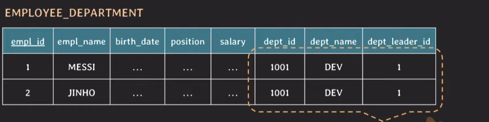
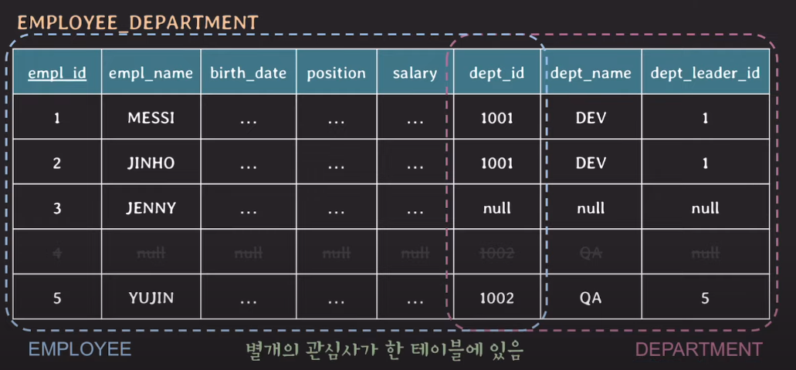
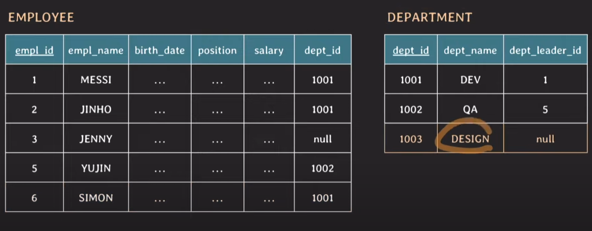
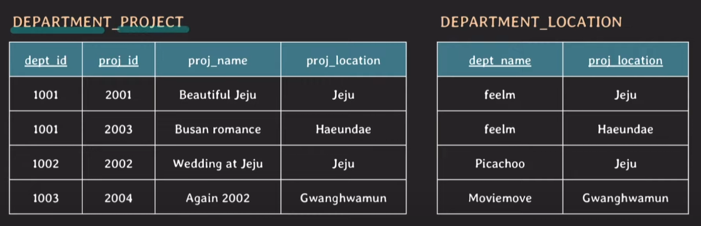
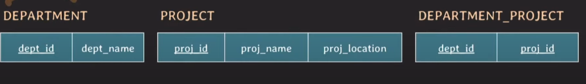

# 테이블 설계 (기초)

## 잘못된 테이블 설계

### 중복된 데이터가 존재하는 테이블

- dept_id만 있으면 되는데, dept_name과 dept_leader_id가 같이 존재함.

- 저장공간 낭비

- 데이터 불일치 가능성 존재

### 여러 관심사가 하나의 테이블에 존재하는 경우 (임직원, 부서)

**[ 잘못된 예시 ]**

- Insertsion anomalies (삽입 이상현상) 발생

    - 부서를 추가할 때, 임직원(null)을 같이 추가해줘야함.

- Deletion anomalies (삭제 이상현상) 발생

    - 임직원을 삭제할 때, 부서에 관한 데이터도 같이 지우게 됨.

- Update anomalies (수정 이상현상) 발생

    - 부서의 이름을 변경한다면?

    - MESSI와 JINHO은 둘다 Dev부서. 부서이름을 같이 변경해야함

    - 골치아파짐

**[ 올바른 예시 ]**

- 이상현상 x

### 

**[ 잘못된 예시 ]**

- proj_location으로 natural 조인을 한다면?

    - 한 row에 dept_name이 두개가 걸리게 됨.

    - dept_id는 같은데 dept_name이 달라지는 현상이 발생. 

    - 잘못된 튜플이 생기게 되는데 이를 Spurious Tuples 라고 한다. (Spurious : 거짓된)

- 사실 너무 잘못된 예시라 잘 와닿지는 않음.

**[ 올바른 예시 ]**

- 부서 테이블 따로, 프로젝트 테이블 따로

- 부서와 프로젝트를 맵핑하는 연관테이블 존재

### null이 많이들어가는 테이블

- null값이 있는 column으로 join하는 경우 예상과 다른 결과 발생

- null이 있는 colmun에 aggregate function을 사용할 때 주의 필요

    - (*) 를 이용해서 카운트 하면 null 관계 없이 해당 튜플을 전부 카운트

    - (특정 column) 을 이용해서 카운트하면 null을 무시하고 카운트 

- 불필요한 storage 낭비

## 올바른 DB 설계

- 의미적으로 관련있는 속성들끼리 테이블 구성

- 중복 데이터를 최대한 허용하지 않도록 설계

- Join 수행 시 가짜 데이터가 생기지 않도록 설계

- 되도록이면 null 값을 줄일 수 있는 방향으로 설계

- 그런데 때로는 성능 향상을 위해서 테이블을 나누지 않는 경우도 존재