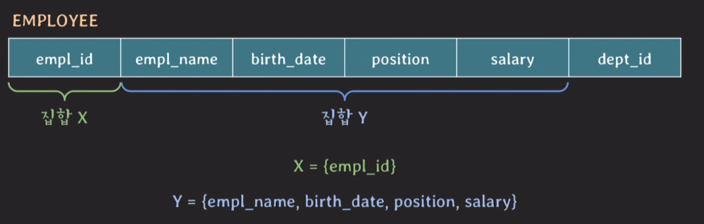
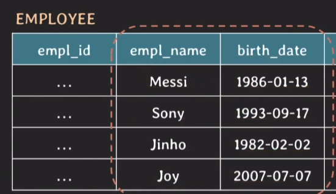
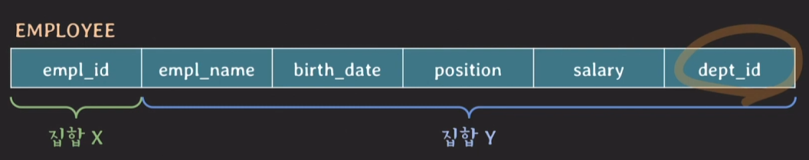
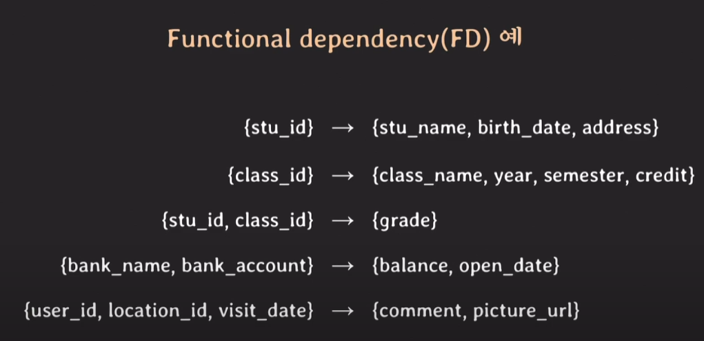

# 테이블 설계 (함수 종속)

## Functional Dependancy (함수 종속)



**위의 경우에서 두 tuple의 X값이 같다면 Y값도 같다**


이 처럼 X값에 따라 Y값이 유일하게 결정될 때 

- 'X가 Y를 함수적으로 결정한다.'

- 'Y가 X에 대해 함수적으로 의존한다'


라고 말할 수 있고 이러한 두 집합 사이의 제약관계를 **functional dependancy (FD)** 라고 부른다.

기호로는 X -> Y 와 같이 나타낸다.

### 잘못 파악한 FD



> {empl_name} -> {birth_date} 라고 볼 수 있을까?

아니다.

동명이인이 있을 경우, empl_name이 birth_date를 완벽하게 결정하지 못한다.

이처럼 FD는 테이블의 상태를 보고 파악하면 안되고,

테이블 스키마를 보고 의미적으로 FD가 존재하는지 파악해야 도니다.




> X -> Y라고 볼수 있을까?

모른다.

임직원 한명당 단 하나의 부서만 가진다면 X -> Y가 성립하지만

임직원 한명이 여러개의 부서를 가질 수 있다면 X -> Y가 성립하지 않는다.

### 여러 FD (Functional Dependancy) 예시




## FD (Functional Dependancy) 의 특징

- X -> Y 가 성립할 때 Y -> X 가 성립하지 않는다.

    - {empl_id} -> {empl_name} 는 성립

    - {empl_name} -> {empl_id} 성립 X (동명이인)

    - 둘다 Unique한 값을 가지면 성립하는 것 같다.

- {} -> Y 

    - Y값은 언제나 하나의 값만 가진다는것을 의미

    - ex) 부서가 하나밖에 없음

    - {} -> {dept_name}

## FD (Functional Dependancy) 의 종류

### Trivial FD

(trivial : 사소한, 하찮은 ?)

```
{a, b, c} -> { c }

{a, b, c} -> {a, c}

{a, b, c} -> {a, b, c}
```

- 왼쪽의 부분집합이 오른쪽에 들어오는 FD

- 너무 당연함...  

- 이런걸 실질적으로 FD로 봐도 되나 싶음. 그래서 따로 분류하는듯 

### Non-Trivial FD
```
{a, b, c} -> {b, c, d}

{a, b, c} -> { d, e} 
```

- Trivial FD가 아니면 Non-Trivial FD

- `{a, b, c} -> {d, e}` 와 같이 공통된 attribute가 하나도 없으면 Completely-Non-Trivial FD

### Partial FD

```
{empl_id, empl_name} -> {birth_date} 

{empl_id} -> {birth_date}
```


- X의 진부분집합 (proper subset)이 Y를 결정할 수 있을 경우 Partial FD

    - (편의상 X는 FD의 왼쪽부분 , Y는 FD의 오른쪽 부분을 의미한다고 가정)

- X에 쓸모없는 원소가 있다는 의미

### Full FD

```
{stu_id, class_id} -> {grade} (성적) 

{stu_id} -x> {grade}

{class_id} -x> {grade}

{} -x> {grade}

```

- X의 모든 진부분집합이 Y를 결정할 수 없음

- X에 쓸모없는 원소가 없다는 의미
