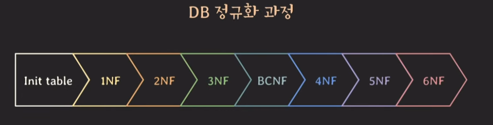
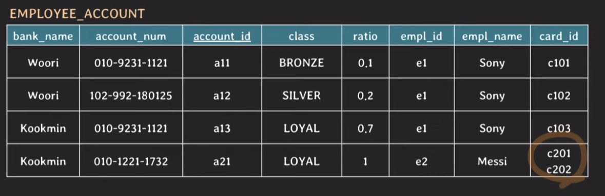
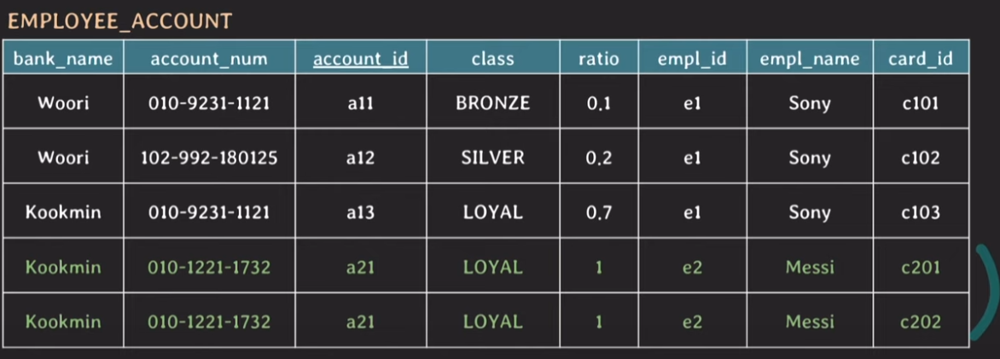
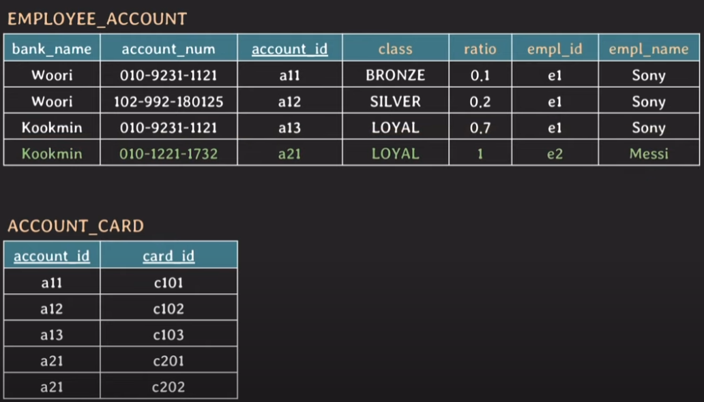
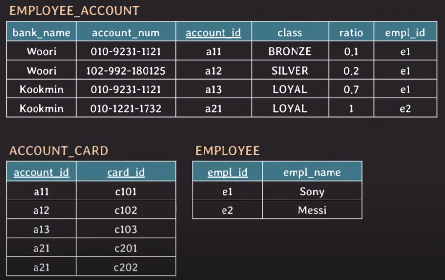
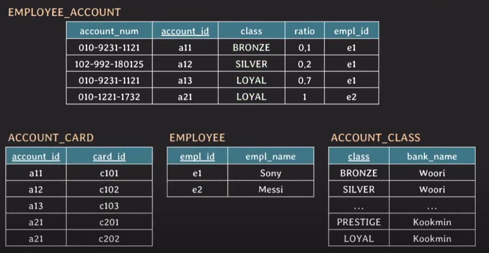
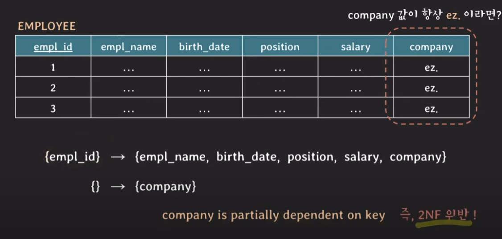
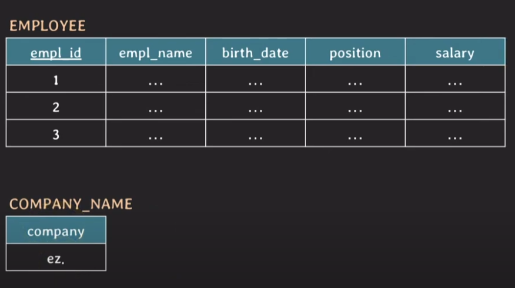

# 테이블 설계 (정규화)

데이터 중복과 insertion, update deletion 이상현상을 최소화 하기위해

일련의 NF(normal forms)에 따라 relational DB를 구성하는 과정

(NF : 정규화 되기 위해 준수해야하는 각각의 룰들)

- 처음부터 순차적으로 진행

- normal form을 만족하지 못하면 만족하도록 테이블 구조를 조정

- 단계별로 순차적으로 진행

- 1NF ~ BCNF는 FD와 key만으로 정의되는 NF (normal form)

- 3NF까지 도달하면 정규화 됐다고 말하기도 함

- 보통 실무에서는 3NF 혹은 BCNF 까지 진행 (많이해도 4NF)

## 정규화 예제

- 임직원의 월급 계좌를 관리하는 테이블

- 월급계좌는 국민은행이나 우리은행 중 하나

- 한 임직원이 하나 이상의 월급 계좌를 등록할 수 있고, 월급 비율을 조정할 수 있다.

- 계좌마다 등급이 있음 (국민 : STAR -> PRESTIGE -> LOYAL), (우리 : BRONZE -> SILVER -> GOLD)

- 한 계좌는 하나 이상의 현금카드와 연동될 수 있다.

### KEY

- SUPER KEY
    
    - table에서 tuple을 유니크하게 식별할 수 있는 attribute set

- candidate key

    - 어느 한 attribute라도 제거하면 unique하게 tuple을 식별할 수 없는 super key (super key 최적화)

    - {account_id}, {bank_name, account_num} 
    
    - {bank_name, account_num}의 경우 서로 다른 은행에서 계좌번호가 겹칠수 있기 때문에 은행이름 포함

- primary key

    - candidate key중에서 선택한 키 {account_id}

- prime attribute

    - 임의의 key에 속하는 attribute

    - account_id, bank_name, account_num

- non-prime attribute

    - prime attribte에 속하지 않는 attribute

    - class, ratio, empl_id, empl_name, card_id

## 1NF

- **attribute의 value는 반드시 나눠질 수 없는 단일한 값이어야 한다.**

### 1NF 이전

### 1NF 이후

- card_id를 단일한 값으로 관리

**[ 문제점 ]**

- 중복데이터가 생김 (row4와 row5를 보면 card_id만 다르고 값이 전부 같음)

- ratio의 합이 1이되어야 하는데 2가 됨

- account_id가 primary key로서 역할을 수행하지 못함. (a21이 2개)

## 2NF

- 모든 non-prime attribute는 모든 key에 대하여 fullly FD를 만족해야 한다.

    - 반대로 말하면 non-prime attribute들이 partialy FD하면 안된다는 이야기 

    - 이 말을 다시 말하면, Candidate Key가 최적화가 되어야 한다는 소리

### 2NF 이전

- 먼저 candidate key와 non-prime attribute를 정리해보자

    - candidate key : {account_id, card_id}, {bank_name, account_num, card_id}  (2개)

    - non-prime attribute : class, ratio, empl_id, empl_name

- 현재 card_id는 non-prime attribute를 전혀 결정하지 못함. (현재 테이블에서 식별 기능이 없는 키)

    - 때문에 각각의 후보키들은 fully FD를 만족하지 않고 , partialy FD함.

    - 즉 2NF를 위반하고 있다.

### 2NF 이후

- card_id만 다르고 다른 attribute는 모두 같은 row가 존재했는데, (row4, row5) 사라짐.

- 중복된 데이터가 많이 사라짐

## 3NF

- X->Y가 존재하고 Y->Z도 존재하면 이를 transitive FD라고 부른다.

    - 추가 조건 : Y와 Z는 어떤키에 대해서도 부분집합이 아니여야 한다.

- 모든 non-prime attribute는 어떤 key에도 transitive dependant하면 안된다.

    - 다른 말로 non-prime attribute와 non-prime attribute 사이에는 FD가 있으면 안된다.

### 3NF 이전

- 현재 transitive FD가 존재한다.

    - {account_id} -> {empl_id} , {empl_id} -> {empl_name},

    - 비슷하게 {bank_name, account_num} -> {empl_id}, {empl_id} -> {empl_name}

    - {empl_id} -> {empl_name} 이 발생함. (둘다 non-prime attribute 인데) 

### 3NF 이후

- 사실 EMPLOYEE_ACCOUNT에는 empl_id만 있으면 되고, empl_name이 있을 필요가 없었음.

    - empl_id로 조인해서 조회하면 되기 때문

- 위의 문제가 해소됨.

## BCNF

- 모든 유효한 non-trivial FD X -> Y는 X가 super key여야 한다.

### BCNF 이전

- {class} -> {bank_name}이 성립함

    - 성립하는 이유는 우리은행의 등급과, 국민은행의 등급들 중에서 서로 겹치는 것이 없기 때문

    - {class}는 super key가 아닌데 {bank_name}을 결정함 (non-trival FD)

    - BCNF조건을 만족하지 못함

### BCNF 이후

- 그런데 이렇게 비즈니스 룰에 의존하는 DB설계는 좋지 못한듯

    - 현재는 우리은행하고 국민은행밖에 없지만, 나중에 은행이 추가되면서 등급이 겹친다면?
    
    - 다시 DB스키마를 변경해야함

## 참고

### 2NF는 key가 composite key가 아니면 자동적으로 만족한다?

- 얼핏보면 그렇게 보이는데 다음과 같은 예외케이스도 있다.

    

- 얘를 2NF를 만족시키려면 아래와 같은 구조여야한다.

    

- 사실 별로 현실성 없는 예제같긴하다.

### 반정규화 (denormalization, 역정규화)

- 정규화된 데이터베이스에서 성능향상이나, 운영의 편리함 등을 위해 의도적으로 정규화 레벨을 낮추는 것

- 과도한 조인을 피할 수 있음.

- 중복 데이터는 늘어나게 됨. -> 데이터 정합성문제 생길 수 있음

- 보통 읽기 성능이 향상되고, 쓰기 성능은 감소함.

## 느낀점..

- 굳이 이런 정규화라는 거창한 과정이 필요한가? 

    - 애초에 처음부터 관심사에 맞춰서 테이블을 잘 설계를 했다면 많은 부분 해결이 되었지 싶은데...

    - 그리고 그냥 중복데이터 보이면 테이블 떼어내면 되는거 아님...?

    - 학술적인 정의로서는 의미가 있지만, 실무에서도 도움이 많이 될지는 잘 모르겠다. 
