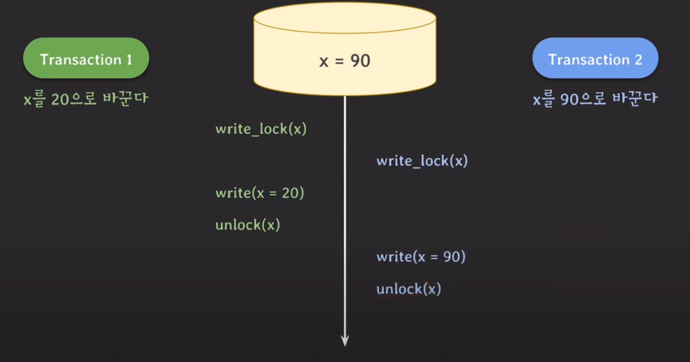
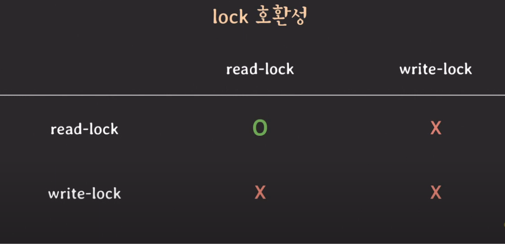
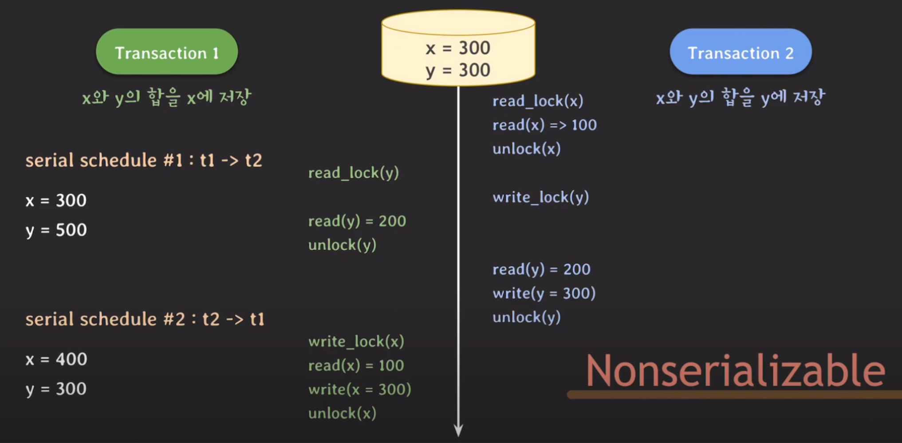
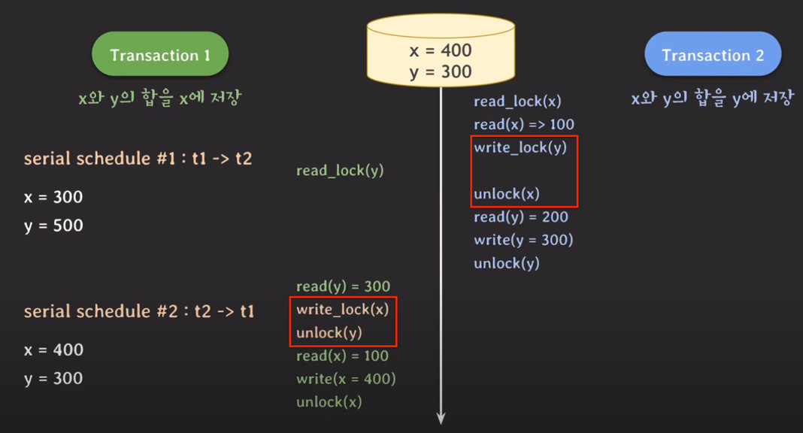
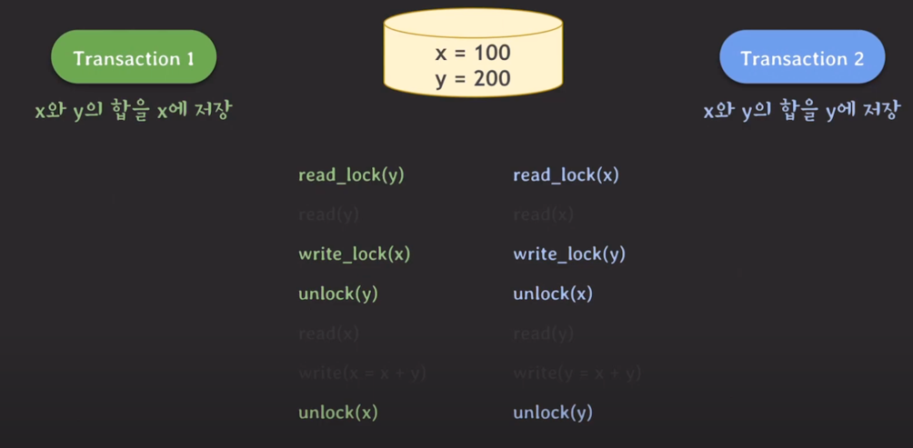
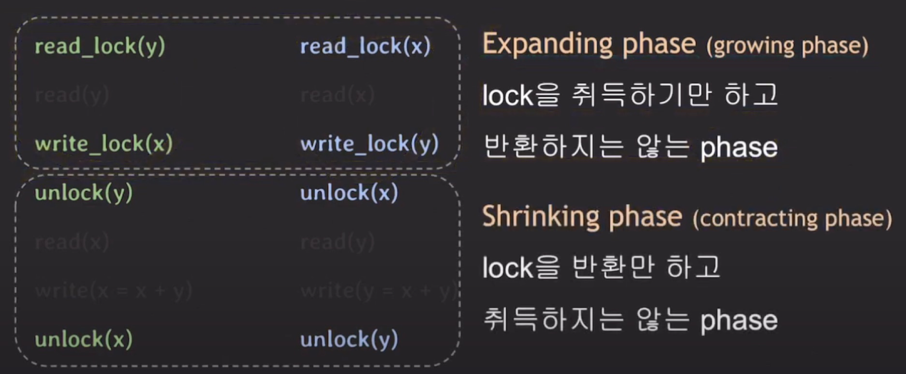
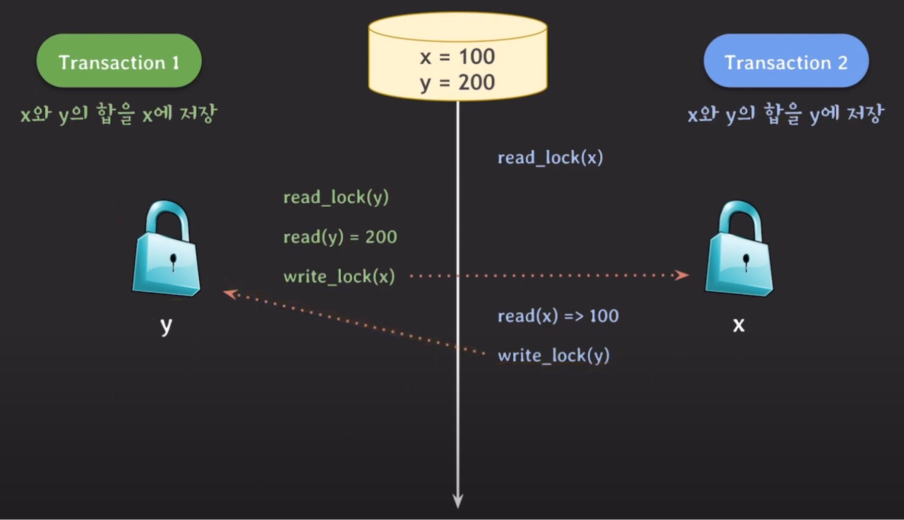
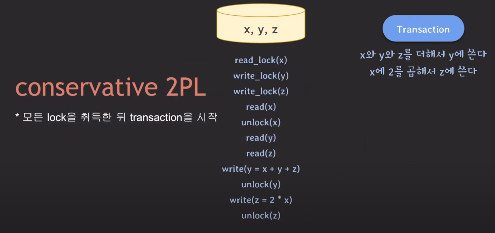
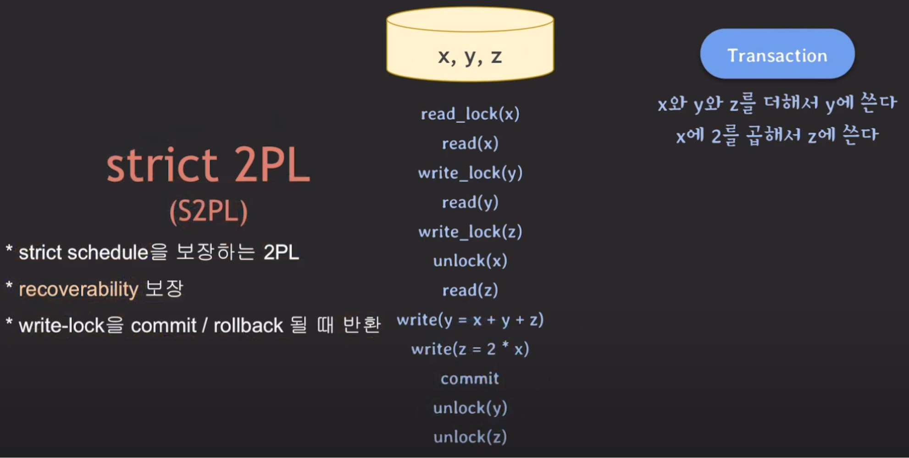
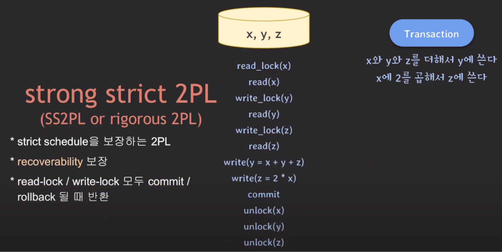

## Lock
2개 이상의 서로 다른 트랜잭션들이 같은 데이터에 대해 read/write 연산을 수행하면 에상치 못한 문제가 발생한다.   
이러한 문제를 해결하기 위한 여러 동시성 제어 기법이 존재하는데, 그 중 하나는 Lock을 사용하는 것이다.   

Lock은 '잠금 장치'라는 뜻 그대로 데이터에 대한 read/write에 제한을 걸어버리고, 이를 통해 데이터의 일관성과 무결성을 보장할 수 있게 된다.   
모든 데이터에는 Lock이 존재하고, 각 트랜잭션은 데이터에 read/write 연산을 수행하려면 lock을 획득해야 한다.   

### 예제
예를 들어 x에는 90이라는 값이 저장되어 있고, tx1은 x를 20으로 바꾸는 작업을 수행하며 tx2는 x를 90으로 바꾸는 작업을 수행한다고 가정해보자.

먼저 시작된 tx1은 x에 대해 write 연산을 수행하려 하고, 이때 lock을 획득한다.   
그리고 tx2가 동일한 데이터 x에 대해 write 연산을 수행하기 위해 lock을 획득하려고 시도한다. 하지만 x에 대한 lock은 이미 tx1이 쥐고 있기 때문에 tx2는 해당 lock이 해제될 때까지 기다려야 한다.   

tx1은 x에 대한 write 연산을 마치고 lock을 해제한다. 따라서 lock이 해제될 때까지 대기하던 tx2가 lock을 획득하여 x를 90으로 수정하고, lock을 해제한다.   

### Lock의 종류
Lock의 종류에는 크게 write-lock(exclusive lock)과 read-lock(shared lock)이 존재한다.   

- **write-lock (exclusive lock)**     
데이터를 read/write할 때 사용된다. 이때 write-lock이라고 해서 write만 가능하지 않고, 핵심은 exclusive라는 단어에 있다는 것에 주의하자.   
어떤 데이터에 대해 write-lock을 가지고 있는 경우 다른 트랜잭션들이 같은 데이터를 read/write하는 것을 허용하지 않는다.   

- **read-lock (shared lock)**    
데이터를 read할 때만 사용된다.      
read-lock의 경우 다른 트랜잭션들이 같은 데이터를 read하는 것은 허용하지만, write하는 것은 허용하지 않는다.   

이 두 종류의 lock들은 다음과 같은 호환성을 가지고 있다고 보면 된다.

한 쪽에서 read-lock을 가지고 있는 경우 write는 허용하지 않고, read만 허용한다.   
반면 write-lock을 가지고 있는 경우 어떤 작업도 허용하지 않는다.

---

## Lock을 이용한 동시성 제어 구현
트랜잭션의 isolation이 보장되기 위해서는, serializability를 제공하는 concurrency control을 구현해야 한다.   
Lock을 통해 이 concurrency control을 어떻게 구현할 수 있을까?

### 문제 상황
Lock을 사용하는 것만으로는 serializability를 보장하지 못하는데, 아래가 그 예시다.

처음에 x에는 100, y에는 200이 저장되어 있고, 각 트랜잭션은 두 데이터의 합을 x, y에 저장하는 작업을 수행한다.   
만약 트랜잭션이 순차적으로 실행되는 serial schedule이라면 정상적인 결과가 나오겠지만, 병렬적으로 실행되는 경우 결과가 달라진다.   
트랜잭션 2가 read_lock(x)을 반환 후 y를 100+200(=300)으로 업데이트하기 위해 write_lock(y)을 획득하려는 사이에 트랜잭션 1이 y에 대한 read_lock(y)을 획득한다.   
이로 인해 트랜잭션 2는 y를 업데이트할 수 없게 되고, 트랜잭션 1은 수정되지 않은 y를 읽음으로써 이상한 결과(x=300, y=300)가 나오게 된다. 즉, nonserializable한 결과가 나타난다.   

### 해결 방안
이러한 이상 현상은 다음과 같이 두 쌍의 operation 순서를 변경하여 해결할 수 있다.

트랜잭션 1이 read_lock(y)을 획득하기 전에 트랜잭션 2가 먼저 y에 대한 write_lock을 획득한다. 그 후 트랜잭션 2가 y를 업데이트하고 lock을 해제할 때까지 트랜잭션 1은 read(y)를 대기한다.   
이로 인해 트랜잭션 1은 업데이트가 이루어진 y를 읽어 제대로 된 결과를 도출할 수 있게 된다.   

---

## 2PL protocol

위 예제에서 lock 관련 operation들만 보면, ***트랜잭션에서 모든 locking operation들이 최초의 unlock operation보다 먼저 수행된다***는 것을 알 수 있다.    
이처럼 lock을 획득하는 구문과 반환하는 구문이 분리되어 동작하는 방식을 2PL(2 Phase Locking) protocol이라고 한다.   

   

2PL protocol은 단 한번이라도 unlock되는 순간 더 이상 lock을 획득할 수 없기 때문에 serializability를 보장한다.   

> #### Deadlock with 2PL protocol
> 2PL protocol이 serializability를 보장할지라도 다음과 같은 상황에서는 deadlock 현상이 발생할 수 있다.
>    
> 트랜잭션 2가 먼저 read_lock(x)을 획득한 상황에서 트랜잭션 1이 read_lock(y)을 획득하고 x에 대해 write 연산을 수행하려고 한다면, 트랜잭션 2의 read_lock(x)이 해제될 때까지 기다려야 할 것이다.   
> 이때 트랜잭션 2가 y에 대해 write 연산을 수행하려 한다면, 트랜잭션 1의 read_lock(y)이 해제될 때까지 기다려야 한다.   
> 이렇게 되면 두 트랜잭션 모두 교착 상태에 빠지게 되는 deadlock 현상이 발생하는 것이다.

### 여러 종류의 2PL protocol
- #### Conservative 2PL
  '보수적인'이라는 단어 뜻에서 알 수 있듯이 모든 lock을 획득한 뒤에 트랜잭션을 시작하는 방식이다.   
     
  맨 처음에 모든 lock을 획득하기 때문에 deadlock이 발생하지 않는다는 점에서 이 방식이 좋다고 생각할 수 있다.   
  하지만 트랜잭션이 시작되기 전에, 필요로 하는 lock을 모두 획득하는 것은 트랜잭션 자체가 시작되기 힘들 수 있기 때문에 실용적이지 않다.
- #### Strict 2PL (S2PL)
  어떤 트랜잭션도 commit되지 않은 트랜잭션들이 쓴 데이터는 쓰지도 읽지도 않는 특성을 가진 strict schedule을 보장하는 2PL이다.   
     
  이 방식은 write_lock을 commit/rollback될 때 반환하기 때문에 recoverability를 보장한다.
- #### Strong Strict 2PL (SS2PL)
  S2PL에서 더 엄격해진 방식으로, write_lock 뿐만 아니라 read_lock까지 모두 commit/rollback될 때 반환한다.   
  구현은 오히려 S2PL보다 더 쉽다는 장점이 있다.   
     
  하지만 이 방식을 사용하면 트랜잭션이 Lock을 상대적으로 오래 쥐고 있게 되기 때문에, 또 다른 트랜잭션이 대기하는 시간이 길어진다는 단점이 있다.   

### 2PL protocol의 단점
2PL protocol 방식의 경우 한 데이터에 대해 서로 다른 트랜잭션이 read-write하거나 write-write하는 경우 한 쪽이 block되기 때문에 전체 처리량이 좋지 않은 편이다.   
여기서 write-write는 어쩔 수 없다 치고, read-write가 서로를 block하는 것이라도 해결하기 위해 나온 대안이 바로 오늘날 가장 많이 사용하는 방식인 MVCC다.