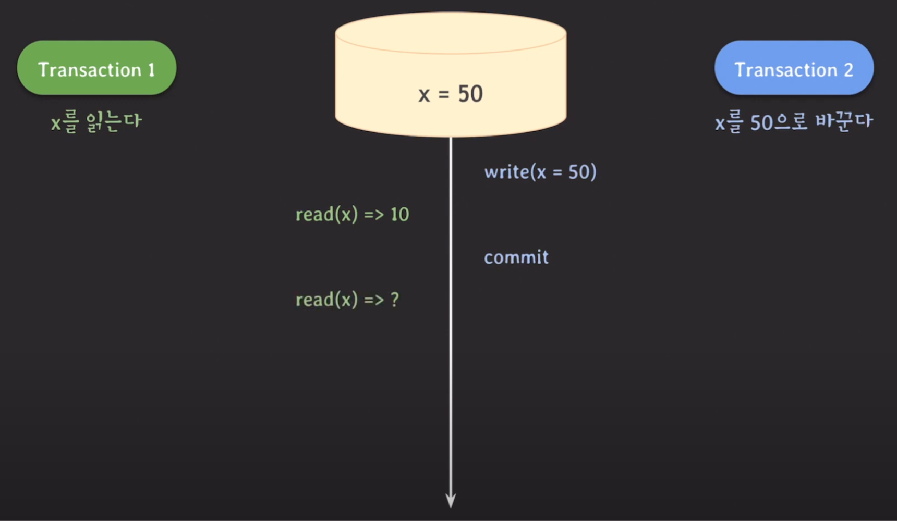
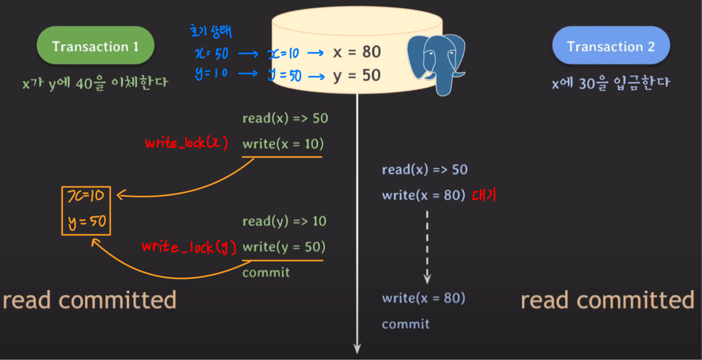
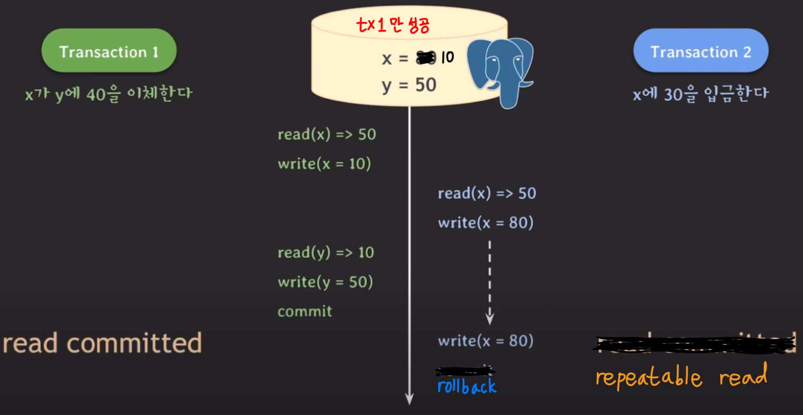
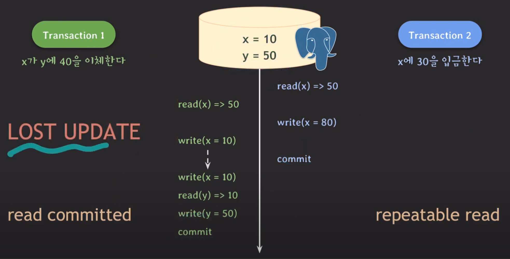
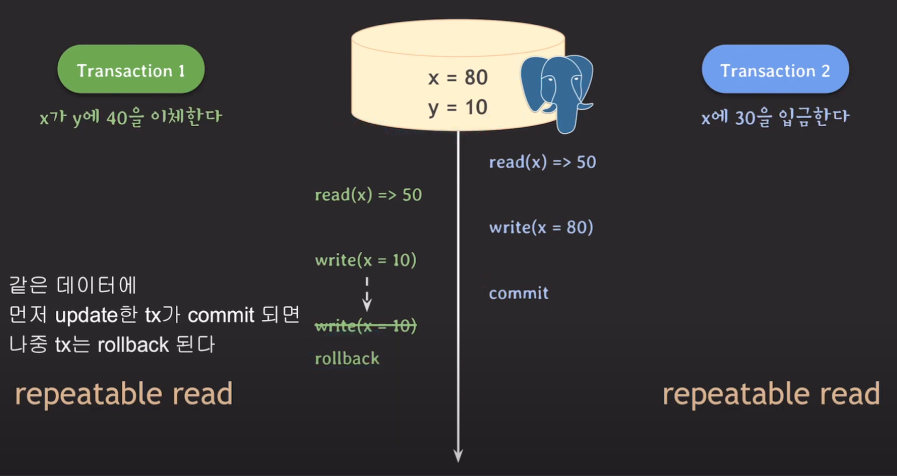
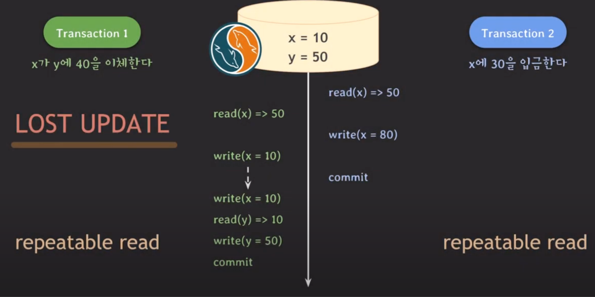
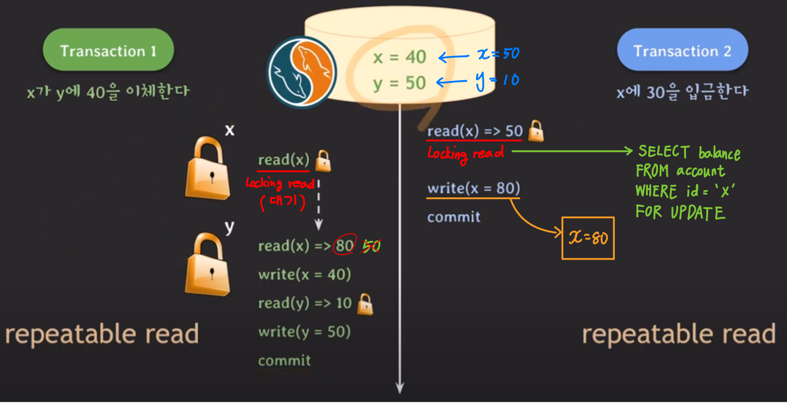
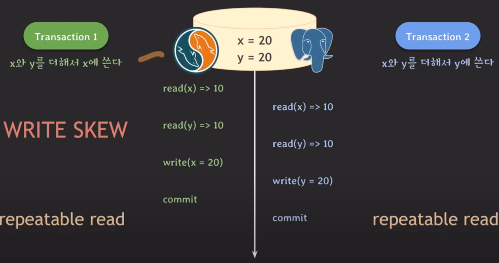
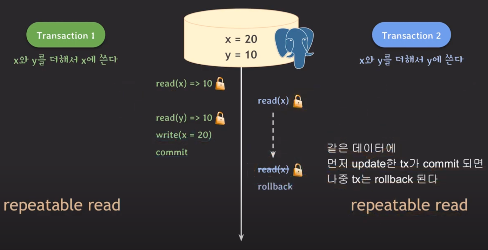

## MVCC (MultiVersion Concurrency Control)
MVCC는 lock 기반 동시성 제어 기법과 달리, 여러 버전의 데이터를 유지함으로써 read와 write가 서로 block되지 않도록 하는 동시성 제어 기법이다.   
즉, write-write 외에는 모두 허용해 동시 처리량을 증가시킨다.

### 특징
- 데이터를 읽을 때 특정 시점(isolation level에 따라 다름) 기준으로 가장 최근에 commit된 데이터를 읽는다.   
  이를 MySQL에서는 **Consistent read**라고 부른다.
- 데이터 변경 이력을 내부에서 관리한다. 따라서 추가적인 저장 공간을 더 많이 사용한다.
- read와 write는 서로를 block하지 않는다.
- Lock 기반 동시성 제어 기법보다 좋은 성능을 가지고 있어 오늘날 많이 사용된다.

### 예제
x에는 10이 저장되어 있으며, 트랜잭션 1과 2는 각각 x를 읽고 x를 50으로 바꾸는 작업을 수행한다.



먼저 트랜잭션 2가 시작되어 write_lock(x)을 획득하고, 트랜잭션 2만 접근 가능한 공간에 x=50을 write한다.   
트랜잭션 2가 변경 내용을 commit하려고 할 때 트랜잭션 1이 x를 read하는데, MVCC는 commit된 데이터만 읽으므로 50이 아닌 10을 가져온다.   
그리고나서 트랜잭션 2는 변경 내용을 commit하여 wriet_lock(x)을 해제한다.
 
> RDBMS는 내부적으로 recoverability를 위해 트랜잭션이 commit될 때 write_lock을 해제하도록 구현되어 있다.

마지막으로 트랜잭션 1이 x를 또 다시 읽게 되는데, 이때 x의 값은 isolation level에 따라 달라진다.   
- #### read committed   
  read하는 시점을 기준으로 그 전에 commit된 데이터를 읽어온다. 따라서 read(x) = 50이 된다.
- #### repeatable read   
  트랜잭션 시작 시점을 기준으로 그 전에 commit된 데이터를 읽어온다. 따라서 read(x) = 10이 된다.
- #### serializable
  - MySQL => MVCC가 아닌 lock 기반으로 동작한다.
  - PostgreSQL => SSI(Serializable Snapshot Isolation) 기법이 적용된 MVCC로 동작한다.
- #### read uncommitted
  MVCC는 commit된 데이터를 읽어오기 때문에 'read uncommitted' level에서는 보통 MVCC가 적용되지 않는다.

---

## Lost update 문제 해결 (feat. PostgreSQL, Mysql)
Lost update란 2개 이상의 트랜잭션이 동시에 실행되어 업데이트 내용을 덮어 쓰게 되는 문제를 말한다.   
이 문제를 MVCC를 구현한 PostgreSQL과 MySQL에서 각각 어떻게 해결하는지 살펴보자.

### PostgreSQL


초기 상태가 x=50, y=10인 DB에서 서로 다른 트랜잭션이 실행된다.   
가장 먼저 tx1이 시작되어 `x=10`을 write해 snapshot에 저장한다. 그리고나서 tx2가 x에 대한 write 연산을 수행하려 하지만, 아직 write_lock(x)이 tx1에 있으므로 대기하게 된다.   
tx1은 이어서 `y=50`을 write하고 snapshot에 저장한다. 이후에 tx1이 commit되면서, x와 y의 값이 변경됨과 동시에 tx1이 획득한 write_lock은 모두 반환된다.   
이제 tx2가 write_lock(x)을 획득하여 write 연산을 수행하는데, 이때 tx2가 읽었던 x의 값은 10이 아닌 50이기 때문에 `x=80`을 write한 후 commit한다.   
이렇게 되면 x=80, y=50이라는 이상한 결과가 나오는 lost update 문제가 발생한다.



위 문제는 isolation level을 repeatable read로 변경함으로써 해결할 수 있다.   
PostgreSQL에서 repeatable read를 적용하면, 같은 데이터에 먼저 update한 트랜잭션이 commit되면 나중에 update하려는 트랜잭션은 반드시 rollback된다.
이를 **first-update-win**이라고 부른다.

> 위 예제에서는 트랜잭션 1이 먼저 시작되었으며, 트랜잭션 2의 isolation level을 repeatable read로 수정하여 문제를 해결했다.   
> 그럼 트랜잭션 2가 먼저 시작되면 어떻게 될까?



tx2가 먼저 시작되면 똑같이 lost update 문제가 발생하고, 최종적으로 트랜잭션 2가 commit되었더라도 해당 내용이 DB에 반영되지 않는다.   
즉, 트랜잭션 2의 isolation level을 repeatable read로 변경하더라도 트랜잭션 1이 먼저 시작되면 문제가 발생하게 된다.



결국 lost update 문제를 해결하기 위해서는 한쪽 트랜잭션의 isolation level만 수정하면 되는 것이 아니라, 연관 있는 다른 트랜잭션의 level도 함께 수정해야 한다.

### MySQL



사실 MySQL은 PostgreSQL과 달리 MVCC를 구현한 상태에서 repeatable read만으로 lost update 문제를 해결할 수 없다.   
MySQL에서 repeatable read를 적용했을 때 데이터에 대한 read 연산을 수행하면, 트랜잭션이 시작되는 순간의 데이터를 읽어오기 때문이다.

따라서 MySQL에서 lost update 문제를 해결하려면 **locking read**를 사용해야 한다.   
> #### Locking read
> 트랜잭션 자신이 update하고 싶은 데이터 또는 다른 트랜잭션으로부터 update를 block하고 싶은 데이터에 대해서 lock을 걸어버리는 read 방식이다.   
> Locing read는 ***isolation level과 관계없이 가장 최근에 commit된 데이터를 가져온다.***
> Locking read는 상황에 따라 exclusive lock 또는 shared lock을 획득할 수 있으며, SQL문은 다음과 같다.   
> - **Exclusive lock (write lock)**
>   ```mysql
>   SELECT 컬럼명 FROM 테이블명 FOR UPDATE; 
>   ```
> - **Shared lock (read lock)**
>   ```mysql
>   SELECT 컬럼명 FROM 테이블명 FOR SHARE; 
>   ```

물론 serializable을 적용하면 locking read 없이 lost update 문제를 해결할 수 있지만, 성능 상의 이슈로 권장하지는 않는다고 한다.   



tx2가 먼저 시작되어 x에 대한 locking read를 통해 write_lock(x)을 획득한다. 이어서 tx1이 x에 대해 locking read를 시도하지만, x에 대한 lock은 tx2에게 있기에 대기 상태에 빠진다.   
그리고나서 tx2는 `x=80`을 snapshot에 저장하고 commit하면서 write_lock(x)을 해제한다.   

tx1은 이제 x를 read하는데, 이때 x의 값은 80이다. locking read를 사용하지 않는다면, repeatable read로 인해 tx1이 시작하는 시점의 데이터를 가져오므로 50을 읽어올 것이다. 하지만 locking read를 사용하면 isolation level과 관계없이 가장 최근에 commit된 데이터를 읽어오기 때문에 80을 가져온다.   
따라서 최종적으로 x=40, y=50이라는 정상적인 결과가 나오게 된다.   

---

## Write skew 문제 해결 (feat. PostgreSQL, MySQL)
Write skew란 2개 이상의 트랜잭션이 서로 다른 데이터에 대해 write 연산을 수행했음에도 데이터 불일치가 발생하는 문제를 말한다.   
MVCC를 구현한 MySQL과 PostgreSQL에서도 이러한 문제가 발생할 수 있는데, 이를 어떻게 해결하는지 살펴보자.   

### 문제 상황


x=10, y=10인 DB에서 x+y를 x에 쓰는 트랜잭션 1과 x+y를 y에 쓰는 트랜잭션 2가 동시에 실행된다.   
tx1과 tx2 모두 x, y를 read한 후 write를 수행하면 그 결과는 x=20, y=20이 된다.   
이는 한쪽 트랜잭션의 결과가 미반영된 것과 마찬가지다.

PostgreSQL과 MySQL 모두 locking read를 통해 이러한 write skew 문제를 해결할 수 있다.

### PostgreSQL 


tx1이 먼저 시작되어 x를 write_lock으로 locking read한다. 그리고나서 tx2가 x를 똑같이 locking read하려는데, 이미 write_lock(x)은 tx1이 가지고 있으므로 대기하게 된다.   
tx1은 `x=20`을 write한 후 commit하면서 write_lock을 모두 반환한다.   
이때 isolation level은 repeatable read이므로 tx2는 rollback된다. 따라서 x=20, y=10이라는 정상적인 결과가 나오게 된다.

### MySQL
tx1은 x를 write_lock으로 locking read한다. 따라서 tx2는 대기 상태에 빠지며, tx1은 x=20을 write한 후 commit한다.   
그리고나서 tx2가 x를 locking read로 읽어오게 되는데, 이때 isolation level과 관계 없이 commit된 값인 20을 읽어온다.   
tx2는 이어서 y를 update하므로 x=20, y=30이라는 정상적인 결과가 나오게 된다.

> 이처럼 PostgreSQL과 MySQL 모두 locking read를 통해 write skew 문제를 해결할 수 있다. 하지만 약간의 동작 방식에 대한 차이로 인해 결과가 달라진다.

### 추가) Serializable level
write skew 문제는 serializable level을 적용해 해결할 수도 있다.

- #### MySQL
  repeatable read와 유사하며, 트랜잭션의 모든 일반적인 SELECT문은 암묵적으로 `SELECT 컬럼명 FOR SHARE`처럼 동작한다.   
  이때 `FOR UPDATE`가 아닌 `FOR SHARE`처럼 동작하는 이유는 exclusive lock를 획득하는 것이 성능상 이슈가 발생할 수 있기 때문이다.   
  하지만 이렇게 `FOR SHARE`로 동작하는 경우 `FOR UPDATE`로 동작할 때보다 deadlock이 발생할 확률이 증가한다.   
  이렇듯 MySQL에서 serializable을 적용하게 되면, 사실 MVCC보다는 Lock 기반으로 동작한다고 볼 수 있다.
- #### PostgreSQL
  MVCC로 동작하면서도 모든 이상 현상을 방지하는 isolation 기법인 SSI(Serializable Snapshot Isolation)로 구현하며, first-commit-win 방식으로 동작한다.