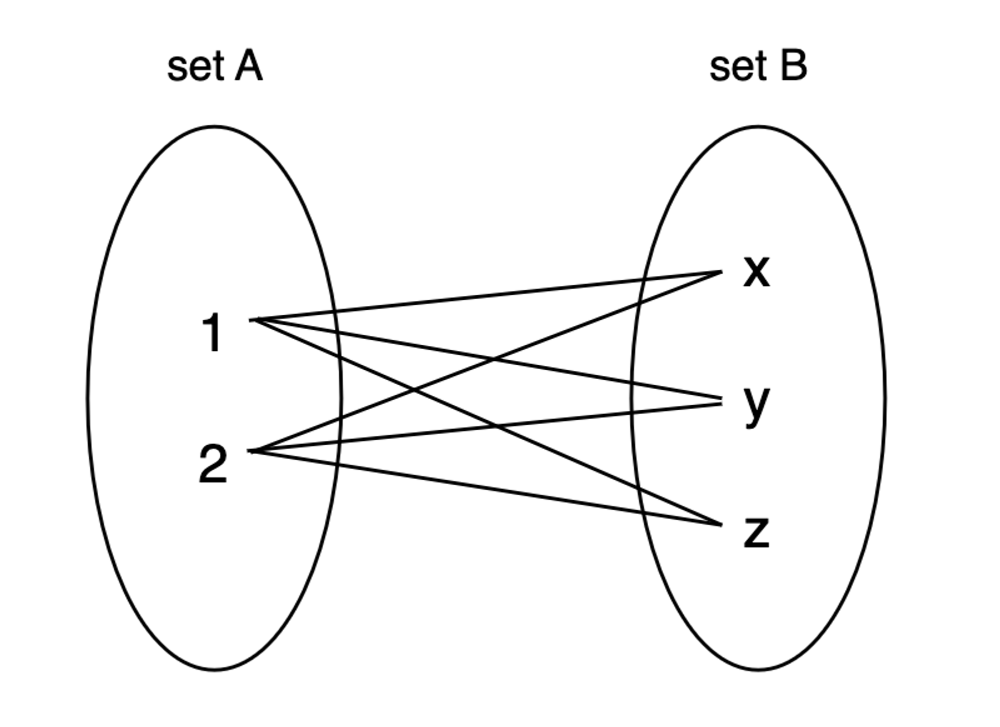
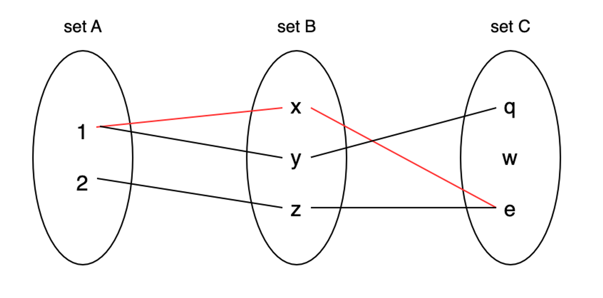
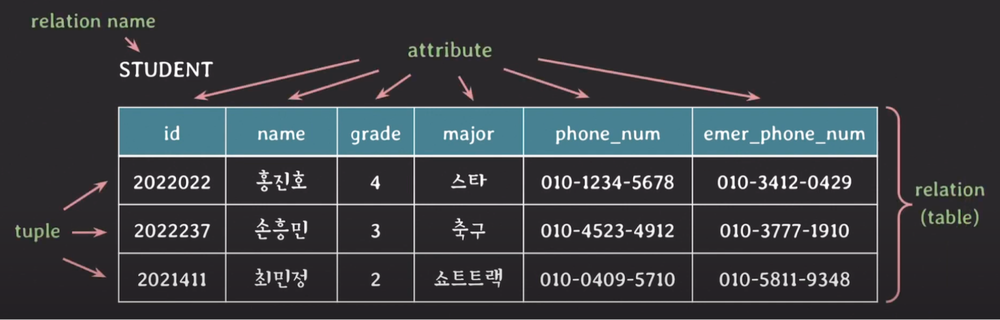
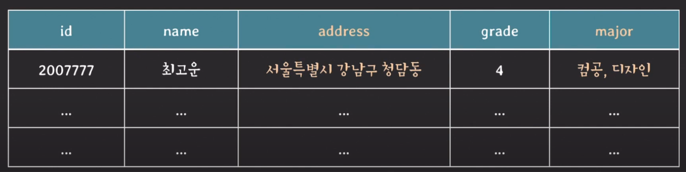

## 수학에서 Relation이 의미하는 개념

수학에서 Relation이란 **Cartesian Product의 부분 집합** 또는 **튜플의 집합**을 의미한다.

### **Cartesian Product**

**Cartesian Product**는 아래 그림에서 set A와 set B에서 각각 하나씩 고른 요소 2개로 만들 수 있는 쌍들의 집합을 의미하며, `A X B = {(a, b) | a ∈ A and b ∈ B}` 로 표현한다.

ex) (1, x), (1, y), (1, z), (2, x), (2, y), (2, z)

### **튜플(tuple)**

튜플은 아래 그림과 같이 n개의 요소들로 이루어진 리스트를 의미한다.

---

## 관계형 모델에서 Relation이 의미하는 개념

위 그림에서 집합을 의미하던 set은 Relational Data Model에서 **domain**을 의미한다.

여기서 domain은 더 이상 나누어질 수 없는 값들의 집합을 말하며, 각각의 domain마다 이름을 붙일 수 있다.   
예를 들어, 학생이라는 개체는 학번과 이름 등 다양한 정보로 나눌 수 있다. 그리고 학번과 이름과 같은 정보들은 무엇인가로 나눌 수 없는 값이다. 이러한 정보들을 각각 domain이라고 할 수 있다.

만약 학생을 여러 domain으로 나눈다면 다음과 같을 것이다.

- `student_ids`: 학번 집합. 8자리 정수
- `human_names`: 학생 이름 집합. 문자열
- `grades`: 학년 집합. {1, 2, 3, 4}
- `major_names`: 전공 이름 집합. 문자열
- `phone_numbers`: 핸드폰 번호 집합

이 domain들을 이용하여 수학적 모델로 나타내면 다음과 같다.

이때 각 domain별 요소들로 이루어진 리스트(하늘색 선)가 바로 **tuple**이다.

그리고 phone_numbers 도메인을 보면, 일반 연락처를 의미하는 phone_num과 사용 목적이 다른 emer_phone_num(비상 연락처)으로도 사용되었다.   
이처럼 동일한 domain이 하나의 relation 안에 2번 이상 사용될 수 있으며, 이들을 구분하기 위해 각 domain이 수행하는 역할을 이름으로 지정한다. 이 이름을 **attribute**라고 부른다.

> ### Relation을 가장 잘 나타낼 수 있는 형식, **Table**
> 위에서 나타낸 수학적 모델은 사실 각 domain에 대한 정보와 관계를 파악하기 쉽지 않다.   
> 따라서 이 Relation을 쉽게 파악할 수 있도록 다음과 같이 나타낸 형식이 있는데, 이를 **table**이라고 한다.
> 
>  
> 
> 이처럼 테이블은 Relation을 나타내는 대표적인 형식인 만큼, Relation을 Table이라고 많이 부른다.

---

## Relation의 특징

- **Relation은 중복된 튜플을 가질 수 없다.**   
  Relation의 개념 자체가 Set of tuples(튜플의 집합)인데, Set은 중복을 허용하지 않는 집합을 의미한다.
- Relation의 **튜플을 식별하기 위해서 attributes의 부분 집합을 Key로 설정**한다.   
  예를 들어, STUDENT 테이블에서 id를 key로 설정할 수 있고, 이는 모든 튜플을 unique하게 식별할 수 있게 해준다.
- **Relation에서 튜플의 순서는 중요하지 않다.**   
  또한, 각 attribute별로 매번 다르게 정렬할 수 있다.
- **하나의 튜플에서 attribute의 순서는 중요하지 않다.**
- **attribute는 atomic, 즉 더 이상 나눌 수 없어야 한다.**   
  예를 들어 다음과 같은 Relation이 있을 때, address는 시, 구, 동으로 나눌 수 있기 때문에 atomic하지 않다. 따라서 시, 구, 동을 각각 다른 attribute로 저장해야 한다.
  major 또한 다수의 값이 들어가 있으므로 atomic하지 않다.

  

## Constraints

관계형 DB의 Relation에는 반드시 지켜져야 하는 제약 조건이 존재한다.   
이 제약 조건의 목적은 DB에 저장된 **데이터의 무결성을 보장**하고, **DB의 상태를 일관되게 유지**하는 것이다.

> #### 무결성(Integrity)
> 무결성이란 데이터의 정확성, 일관성을 나타낸다.
> 다시 말해서 데이터에 결함이 없는 상태, 즉 데이터를 정확하고 일관되게 유지하는 것을 의미한다.

### Implicit constraints

implicit이 ‘절대적인’이라는 사전적 의미를 가지고 있듯이, Relational data model 자체가 가지는 절대적인 제약 조건을 말한다.

- Relation은 중복되는 튜플을 가질 수 없다.
- Relation 내에서는 같은 이름의 attribute를 가질 수 없다.

### Explicit constraints

explicit이 ‘명확한’이라는 사전적 의미를 가지고 있듯이, DDL을 통해 Schema에 직접 명시할 수 있는 제약 조건을 말한다.

- **Domain constraint**: attribute의 값은 해당 attribute의 domain에 속하는 값과 동일해야 한다.

  

  100은 grade라는 학년 domain 값인 {1, 2, 3, 4} 에 포함되지 않기 때문에 제약 조건을 위반한다.

- **Key constraint**: 서로 다른 튜플들은 같은 값의 key를 가질 수 없다.

  

  홍진호라는 이름의 학생과 손흥민이라는 이름의 학생을 의미하는 두 튜플의 id가 동일하기 때문에 제약 조건을 위반한다.

- **NULL value constraint**: attribute가 NOT NULL로 명시된 경우 NULL을 값으로 가질 수 없다.
- **Entity integrity constraint**: 기본키를 가리키는 attribute는 NULL을 가질 수 없다.
- **Referential integrity constraint**: 자식 Relation의 외래키 값은 부모 Relation의 기본키 값과 같아야 하며, PK가 가질 수 없는 값을 FK가 가질 수는 없다.

  

  PLAYER 테이블에 있는 한 튜플의 team_id가 ‘team_023’인데, 해당 값은 TEAM 테이블의 id 컬럼에 존재하지 않는다. 따라서 이는 제약 조건을 위반한다.
