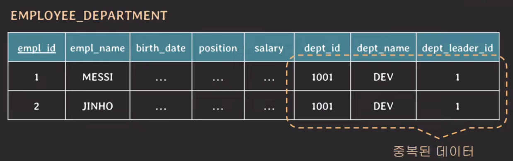
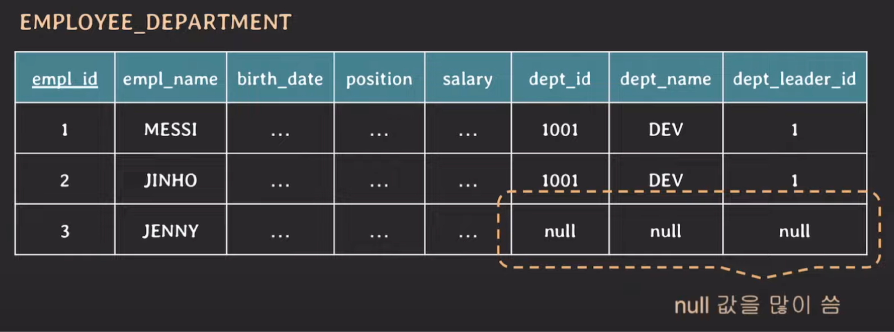
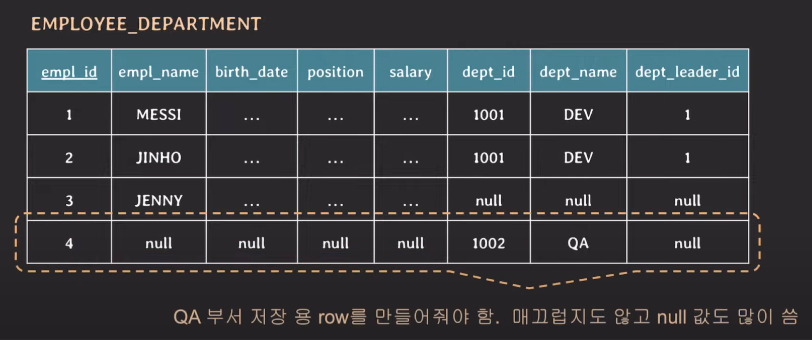
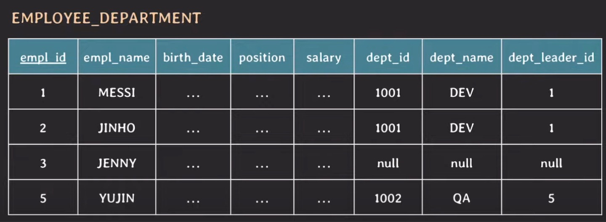
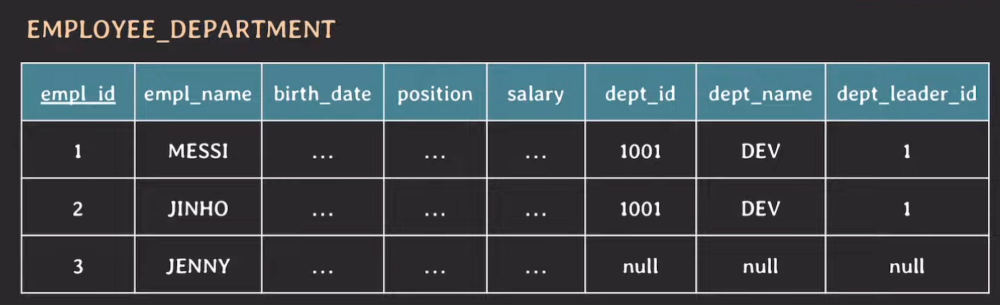
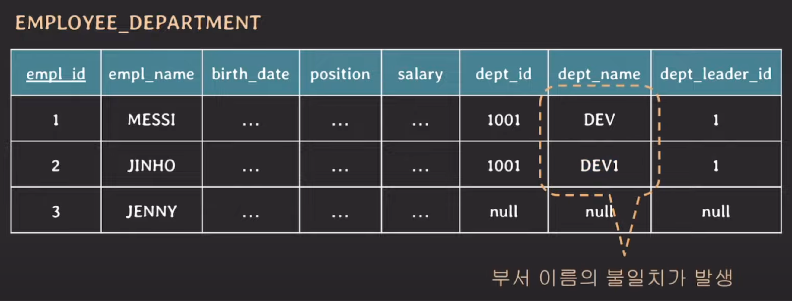
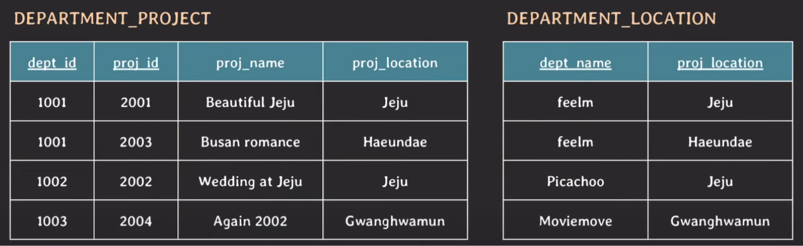
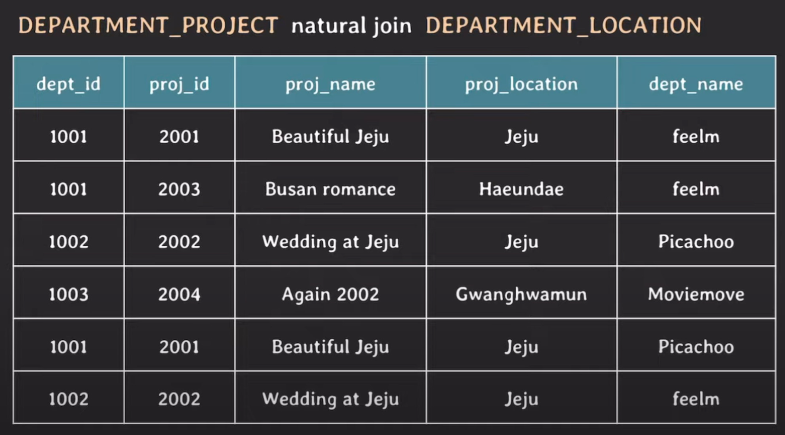
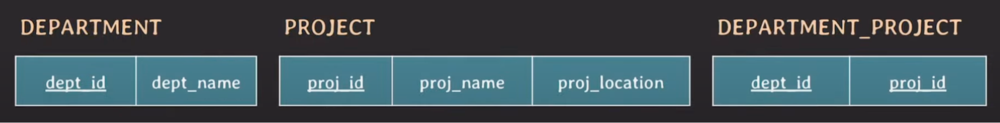

# 이상현상
DB schema 설계를 잘못하면 다양한 문제가 발생할 수 있다.

## 중복 데이터 문제
### Insertion anomalies
데이터를 추가(insert)할 때 발생할 수 있는 이상현상.

> #### 중복 데이터는 어떤 문제를 발생시킬까?
>   
> 위와 같이 중복된 데이터가 계속 쌓이게 되면 저장 공간을 낭비하게 되며, dept_name 컬럼에 데이터 입력 시 'DEV'가 아닌 'DEB'로 잘못 입력하는 등 실수로 인한 데이터 불일치 문제도 발생할 수 있다.    
> 따라서 가능한 중복 데이터는 최소화하는 것이 좋다.

- #### 아직 부서 배치를 받지 못한 임직원의 경우 다음과 같이 부서 관련 컬럼에 null을 저장해야 한다. 
      
    이렇게 null 값을 많이 사용하게 되면 다음과 같은 문제점들이 발생할 수 있다.
  
  - null 값이 있는 컬럼으로 join하는 경우 상황에 따라 예상과 다른 결과가 발생하게 된다.
  - null 값이 있는 컬럼에 aggregate function을 사용할 때 주의가 필요하다.   
    (집계 함수는 null을 제외하고 연산하는 것이 원칙)
  - 저장 공간이 불필요하게 낭비된다.
  
  따라서 가능한 null은 적게 사용하는 것이 좋다.

- #### 임직원이 한 명도 없는 부서 정보를 추가하는 경우 불필요한 row를 추가해줘야 한다.
    
  신설 QA 부서에 임직원이 아직 없으므로 부서 정보를 제외한 모든 컬럼에는 null을 입력한다.
  이로 인해 PK인 empl_id에 임시로 4라는 값을 넣어야 하기 때문에 매끄럽지도 않고, null 값도 많이 쓰게 된다.     
  또한, 신설 부서에 첫 임직원이 들어오는 경우 QA 부서 저장용 row를 삭제해줘야 한다.

### Deletion anomalies
데이터를 삭제(delete)할 때 발생할 수 있는 이상 현상.

위와 같은 테이블에서 `YUJIN` 정보를 삭제한다면, 애꿎은 부서 정보까지 사라지게 된다.

### Update anomalies
데이터를 수정(update)할 때 발생할 수 있는 이상 현상.

만약 'DEV' 부서의 이름이 'DEV1'로 변경된 상태에서, 'JINHO' 임직원의 데이터만 변경되었다면 어떻게 될까?

위와 같이 'MESSI', 'JINHO' 두 명의 임직원은 같은 'DEV1' 부서에 속하는데, 두 명의 데이터는 서로 달라지는 문제가 발생한다.  

---

## Spurious Tuples

다음과 같이 부서별로 진행하는 프로젝트와 그 프로젝트의 위치 정보를 저장하는 2개의 테이블이 있다고 가정해보자.

두 테이블을 natural join한다면 다음과 같은 결과가 나오게 된다.

결과를 자세히 보면, 프로젝트 이름이 'Beautiful Jeju'이면서 프로젝트 위치는 'Jeju'인 동시에 부서 이름이 'Picachoo'인 tuple이 존재한다.  
이 tuple과 그 다음 tuple은 사실 join하면서 생긴 가짜 정보다. 이처럼 테이블이 잘못 설계된 상태에서 join했을 때 새로 생기는 실제 없는 tuple을 spurious tuple이라고 한다.  

이 문제는 다음과 같이 테이블을 분리함으로써 해결할 수 있다.

서로 다른 관심사끼리 테이블을 분리한 다음에, 분리한 두 테이블을 연결하기 위해 기본키를 추가해주었다.

---

## 올바른 DB schema 설계 방법
위에서 살펴본 이상 현상이 발생하지 않게 하기 위해서는 DB schema를 잘 설계해야 하는데, 이를 위한 방법은 다음과 같다.

- 의미적으로 관련 있는 속성들끼리 테이블 구성한다. 즉, 여러 관심사를 하나의 테이블에 놓지 않는다.
- 중복 데이터를 최대한 허용하지 않도록 설계한다.
- join 수행 시 가짜 데이터가 생기지 않도록 설계한다. 이 경우 PK와 FK를 잘 활용하면 된다.
- 되도록 null 값을 줄일 수 있는 방향으로 설계한다.

물론 테이블을 무조건적으로 분리하는 방향으로 설계할 것까지는 없다. 여러 테이블을 동시에 join하면 성능 이슈가 발생할 수 있으므로, 일부러 테이블을 나누지 않는 것도 방법이다. 