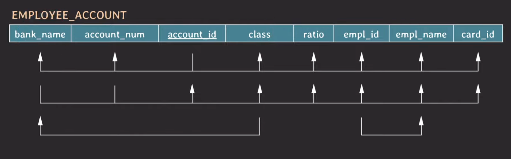
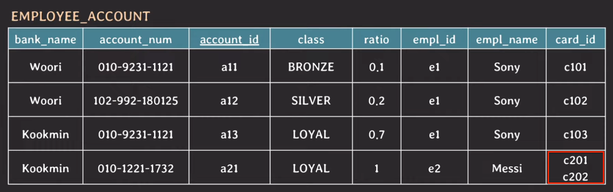
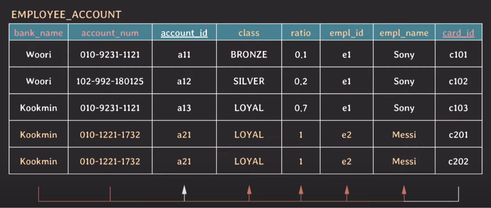
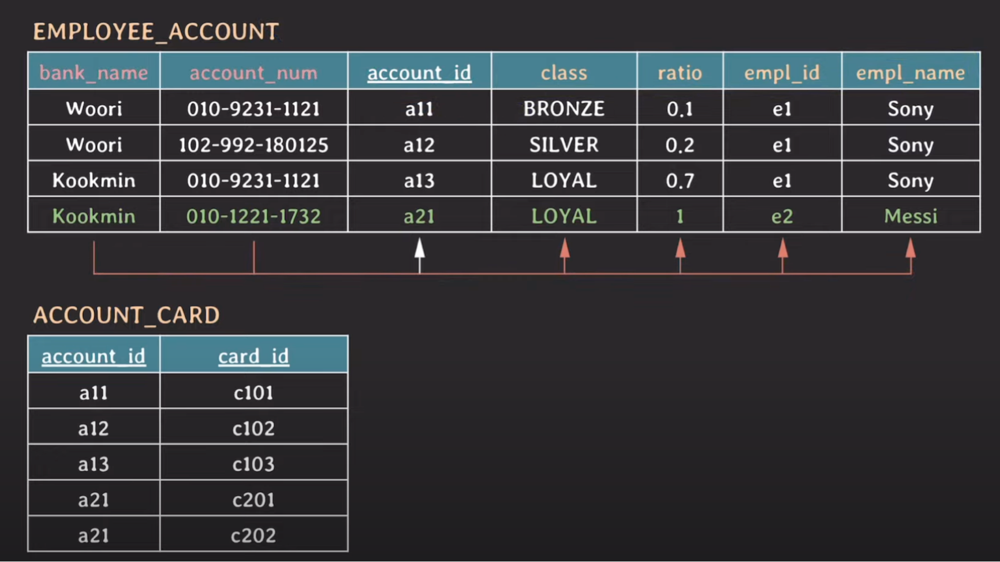
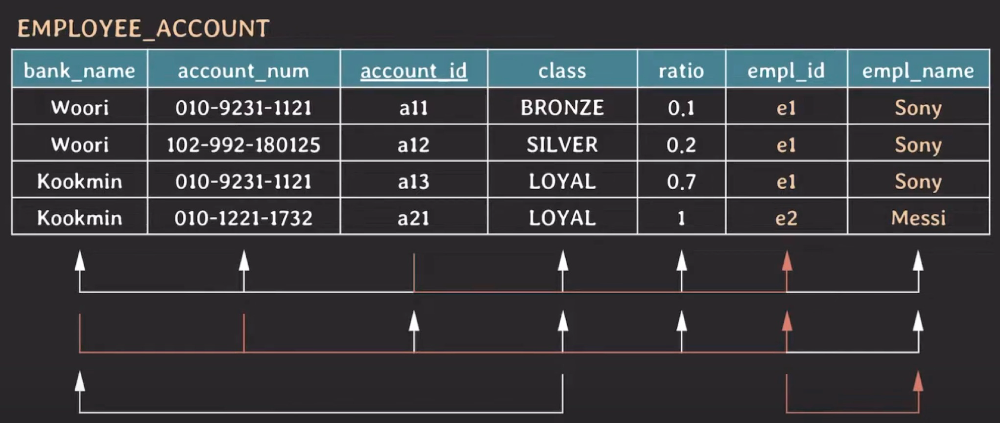
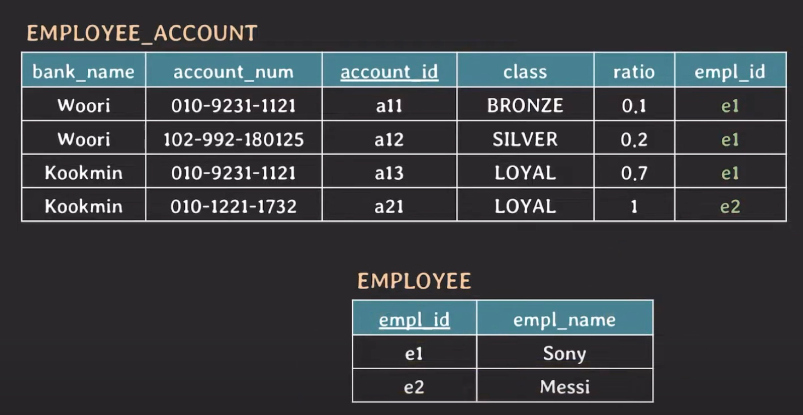
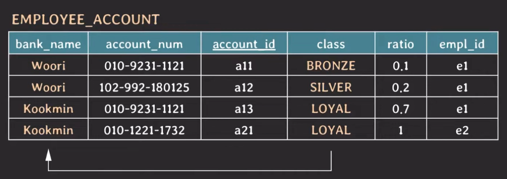
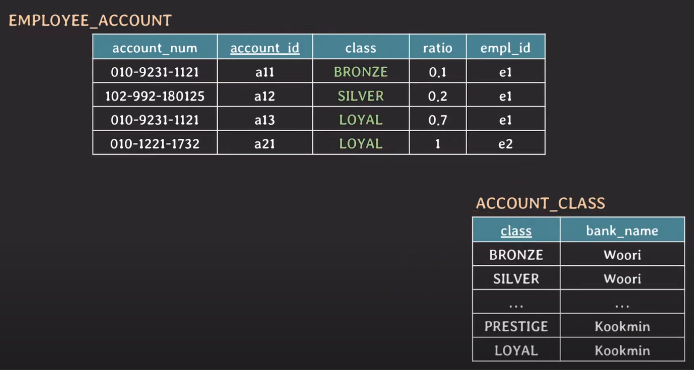

## DB 정규화
데이터 중복과 insertion, update, deletion anomaly 등 여러 이상 현상을 최소화하기 위해 일련의 Normal Forms(NF)에 따라 RDB를 구성하는 과정을 **정규화(normalization)** 라고 한다.   
여기서 NF란 정규화되기 위해 준수해야 하는 rule을 말하며, 1NF부터 6NF까지 존재한다.   

### DB 정규화 과정
정규화는 처음부터 순차적으로 진행하며, normal form을 만족하지 못할 경우 만족하도록 테이블 구조를 조정하는 방식으로 진행한다.   
이때 앞 단계를 만족해야 다음 단계로 진행할 수 있다. 즉, 3NF에 따라 정규화를 진행하려면 1NF와 2NF는 이미 완료되어 있어야 한다.   

normal form은 총 7개로 구성되어 있는데, 일반적으로 3NF까지 도달하면 정규화되었다고 말한다. 실무에서도 보통 3NF나 BCNF까지만 진행한다. (많이 해도 4NF까지 진행)   
그 이유는 FD와 key만으로 정의되는 normal form이 BCNF까지이며, 그 이후 단계에서는 발생할 수 있는 케이스가 매우 적고 복잡하기 때문이다.

### 예제에 사용할 테이블
아래는 이번 DB 정규화 과정에 사용할 임직원의 월급 계좌를 관리하는 테이블이다. 

각 attributes와 key에 대한 설명은 다음과 같다.
- `bank_name`
  계좌의 은행 이름을 나타내며, 이 컬럼에는 '국민'과 '우리' 둘 중 하나만 들어간다.
- `class`
  계좌마다 등급이 존재하며, 각 은행별 등급은 다음과 같다.
  - 국민 은행: STAR -> PRESTIGE -> LOYAL
  - 우리 은행: BRONZE -> SILVER -> GOLD
- `ratio`
  임직원은 하나 이상의 월급 계좌를 등록할 수 있으며, 각 계좌별 월급 비율(0~1)을 조정할 수 있다. 
- `card_id`
  하나의 계좌는 하나 이상의 현금 카드와 연동할 수 있으며, 해당 카드의 id를 기준으로 연동된다.
- **(candidate) key**: `{account_id}`, `{bank_name, account_num}`
- **primary key**: `account_id`
- **prime attribute**: 임의의 key에 속하는 attribute
  - account_id
  - bank_name, account_num
- **non-prime attribute**: 어떤 key에도 속하지 않는 attribute
  - class, ratio, empl_id, empl_name, card_id

### 예제 테이블의 functional dependency
예제 테이블에는 다음과 같이 4개의 FD가 존재한다. 

- `{account_id} -> {bank_name, account_num, class, ratio, empl_id, empl_name, card_id}`
- `{bank_name, account_num} -> {account_id, class, ratio, empl_id, empl_name, card_id}`
- `{class} -> {bank_name}`   
  국민, 우리 은행의 등급 중에서 겹치는 값은 존재하지 않는다. 따라서 class가 bank_name을 결정할 수 있게 되는 것이다.
- `{empl_id} -> {empl_name}`

### 1NF
1NF를 만족하려면 attribute의 값은 반드시 나눠질 수 없는 단일한 값이어야 한다.

account_id가 a21인 tuple의 card_id 컬럼에는 2개의 값이 들어 있다. 이는 단일한 값이 아니므로 1NF를 위반한다.   
이러한 형태의 테이블에서는 update anomaly와 deletion anomaly가 발생할 수 있다.
예를 들어, c201 카드의 계좌를 변경하면 c202의 계좌도 변경되어 버린다.

이러한 문제를 해결하기 위해, 하나의 tuple을 추가해 값을 분리하는 방식으로 정규화를 진행하면 다음과 같은 결과가 나온다.

여기서 문제는 새로운 tuple을 추가하면서 PK가 중복되어버리기 때문에 어쩔 수 없이 PK를 {account_id, card_id}로 수정해야 한다는 것이다.   
이는 중복 데이터를 발생시키는 주요 원인이 되는데, 그 이유는 다음과 같다. 

bank_name과 account_num만으로도 non-prime attriubtes(clss, ratio, empl_id, empl_name)를 결정할 수 있다.   
그럼에도 불구하고 실제 key는 card_id까지 포함하고 있는데, 이 card_id만 다른 값들이 생기는 바람에 중복 데이터가 발생하는 것이다.   

### 2NF
2NF를 만족하려면 부분적 함수 종속(Partial FD)을 제거해야 한다. 즉, 모든 non-prime attribute에 대한 모든 FD는 완전 함수 종속(full FD)이 되어야 한다.

이러한 2NF의 조건을 만족하기 위해 card_id를 따로 분리하는 방식으로 정규화를 진행하면 다음과 같은 결과가 나온다.

이때 두 테이블은 연결되어 있어야 하므로 ACCOUNT_CARD 테이블에 account_id를 넣어준다. 이렇게 되면 추후에 account_id로 두 테이블을 join할 수 있게 된다.   
EMPLOYEE_ACCOUNT 테이블에서 card_id를 분리한 후 완벽히 동일한 tuple 중 하나를 제거하면 제 2 정규화는 끝이 난다.

### 3NF
3NF를 만족하려면 모든 non-prime attribute의 어떤 key에 대한 이행적 함수 종속(Transitive FD)을 제거해야 한다. 즉, non-prime attribute끼리 FD가 존재해서는 안 된다.

위 테이블에는 다음과 같은 transitive FD가 존재한다.

1. {account_id}는 {empl_id}를 결정할 수 있으며, {empl_id}는 {empl_name}를 결정할 수 있다. 따라서 `{account_id} -> {empl_name}`이라는 FD가 성립된다.
2. {bank_name, acount_num}은 {empl_id}를 결정할 수 있으며, {empl_id}는 {empl_name}를 결정할 수 있다. 따라서 `{bank_name, account_num} -> {empl_name}`이라는 FD가 성립된다.

이러한 transitive FD를 제거하기 위해 `{empl_id} -> {empl_name}` FD를 분리하면 다음과 같은 결과가 나온다.   

EMPLOYEE 테이블에 `{empl_id} -> {empl_name}` FD가 성립되도록 하고, EMPLOYEE_ACCOUNT 테이블에서는 empl_name을 제거한다.   

### BCNF
BCNF를 만족하려면, 모든 유효한 non-trivial FD에서 X가 super key여야 한다.

`{class} -> {bank_name}`는 non-trivial FD이지만, class는 super key가 아니다. 즉, 이 테이블은 BCNF를 위반한다.   
따라서 점점 더 많은 데이터가 추가되면 bank_name에는 중복 데이터가 많아지게 될 것이다.

이러한 문제를 해결하기 위해, X가 super key가 아닌 non-trivial FD를 분리하는 방식으로 정규화를 진행하면 다음과 같은 결과가 나오게 된다.

`{class} -> {bank_name}`을 새로운 테이블로 분리해주고, 기존 테이블에서 bank_name을 제거한다. 이때 join을 위해 class는 남겨야 함에 주의하자.   
ACCOUNT_CLASS 테이블에는 정확히 6개의 row만 존재하며, 더 이상 bank_name에 데이터가 중복되어 쌓이지 않게 된다.