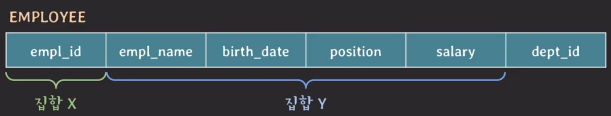
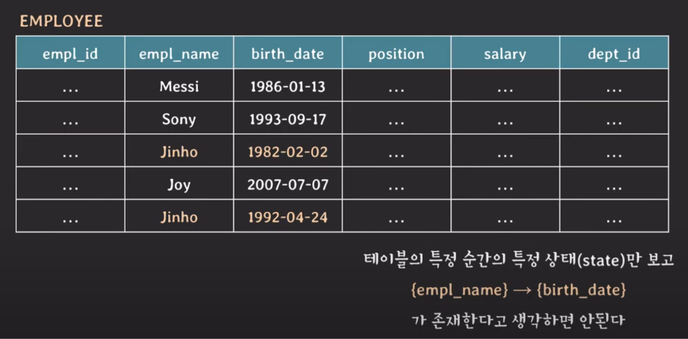
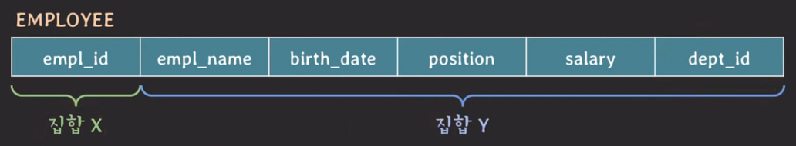
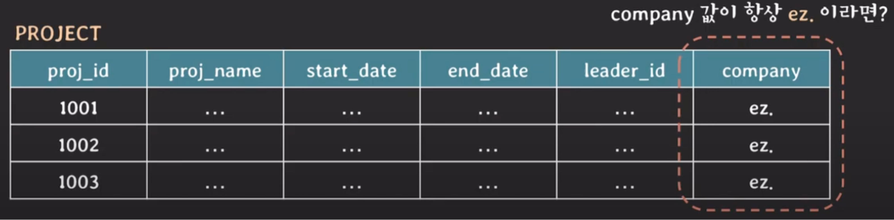

## Functional Dependency
함수 종속(Functional Dependency)이란 하나의 테이블에 있는 두 개의 attribute 집합 사이의 제약을 말한다.

위와 같은 테이블에서 두 tuple의 X 값(empl_id)이 같다면, 이는 Y 값(empl_name, birth_date, ...)도 같음을 의미한다.

다시 말해서 집합 X의 값에 따라 집합 Y의 값이 유일하게(uniquely) 결정될 때 이는 다음과 같이 말할 수 있다.   
- 'X가 Y를 함수적으로 결정한다(functionally determine)'
- 'Y가 X에 함수적으로 의존한다(functionally dependent)'

이러한 두 집합 사이의 제약 관계를 **함수 종속(FD, Functional Dependency)** 이라고 하며, 두 집합 사이의 FD는 `X -> Y`로 표현한다.   

### FD를 파악하는 방법
FD(Functional Dependency)는 테이블의 상태가 아닌 **schema를 보고 의미적으로 파악**해야 한다.   

예를 들어, 임직원의 이름이 같다고 해서 생일도 같을 것이라 판단해서는 안 된다. 이름은 같고 생일은 다른 동명이인이 존재할 수도 있기 때문이다.   
따라서 `{empl_name} -> {birth_date}`라는 FD는 성립되지 않는다.

> #### 의미적으로 파악해야 함에 중점을 두자.
> 만약 집합 Y가 dept_id까지 포함한다면 어떻게 될까?
> 
> 
> 
> 한 명의 임직원이 여러 부서에 속할 수 있다면, 같은 X에 대해 여러 Y가 존재할 수 있을 것이다.   
> 따라서 X가 Y를 결정하지 못하게 된다.
> 
> 이렇듯 구축하려는 DB의 attribute가 관계적으로 어떤 의미를 지니는지에 따라 FD들이 달라질 수 있으므로, 의미적으로 잘 파악하는 것이 중요하다.

### 예제
- #### `{stu_id} -> {stu_name, birth_date, address}`
  stu_id는 학생을 고유적으로 식별하기 위한 값이다. 따라서 학생의 id가 동일하다면 이름, 생일, 주소도 동일할 것이다.   
  이는 stu_id가 오른쪽에 있는 attribute들을 결정함을 의미한다.
- #### `{class_id} -> {class_name, year, semester, credit}`
  class_id는 수업 이름, 연도, 학기, 학점을 결정한다.
- #### `{stu_id, class_id} -> {grade}`
  학생 id와 수업 id가 함께 있다면, 이 attribute를 통해서 그 학생이 해당 수업에서 받은 성적을 결정할 수 있다.
- #### `{bank_name, bank_account} -> {balance, open_date}`
  은행 이름과 계좌 번호가 함께 있다면, 해당 은행에 속한 계좌의 잔액과 개설일을 결정할 수 있다.   
  만약 집합 X에 계좌 번호만 있다면, 서로 다른 은행에서도 우연히 같은 계좌 번호가 있을 수 있기 때문에 FD가 성립되지 않는다. 
- #### `{user_id, location_id, visit_date} -> {comment, picture_url}`
  위치 기반 sns에서 사용자의 id와 방문 지역, 방문 날짜가 모두 동일하다면, 해당 사용자의 댓글과 사진도 동일할 것이다.

> #### {} -> Y
> `{} -> Y`라는 FD는 Y 값이 언제나 하나의 값만을 가진다는 것을 의미한다.   
> 
> 
> 
> 예를 들어, PROJECT 테이블의 company에는 원래 여러 값이 들어갈 것이라고 예상했는데, 결국 하나의 동일한 값만 들어간다고 했을 때 이를 FD로 표현하면 `{} -> {company}`가 된다.

### FD의 종류
- #### Trivial functional dependency
  `X -> Y`라는 FD가 있을 때, Y가 X의 부분 집합이라면 `X -> Y`를 trivial FD라고 부른다.   
  예를 들어, `{a, b, c} -> {c}`의 경우 {c}는 {a, b, c}의 부분 집합이므로 trivial FD다.

- #### Non-trivial functional dependency
  `X -> Y`라는 FD가 있을 때, Y가 X의 부분 집합이 아니라면 `X -> Y`를 non-trivial FD라고 부른다. 즉, trivial FD가 아니면 non-trivial FD다.   
  예를 들어, `{a, b, c} -> {b, c, d}`의 경우 {b, c, d}는 {a, b, c}의 부분 집합이 아니므로 non-trivial FD다.
  더 나아가 `{a, b, c} -> {d, e}`의 경우 두 집합에는 공통된 attribute가 하나도 없는데, 이를 completely non-trivial FD라고 부른다.

- #### Partial functional dependency
  `X -> Y`라는 FD가 있을 때, X의 어떤 proper subset이 Y를 결정할 수 있다면 `X -> Y`를 partial FD라고 부른다.   
  예를 들어, FD `{empl_id, empl_name} -> {birth_date}`의 경우 {empl_id}가 {birth_date}를 결정할 수 있기 때문에 partial FD라고 할 수 있다.  

  > #### proper subset이란?  
  > X의 proper subset은 X의 부분 집합이지만 X와 동일하지는 않은 집합을 의미한다.   
  > 예를 들어 {a, b, c}라는 집합 X가 있을 때, {a, c}, {b}, {}는 X의 proper subset이다. 반면에 {a, b, c}는 X와 동일하므로 proper subset이 아니다. 

- #### Full functional dependency
  `X -> Y`라는 FD가 있을 때, X의 모든 proper subset이 Y를 결정하지 못한다면 `X -> Y`를 full FD라고 부른다.   
  예를 들어, FD `{stu_id, class_id} -> {grade}`의 경우 {stu_id}, {class_id}, {}는 모두 다음과 같은 이유로 {grade}를 결정할 수 없다.
  - `{stu_id} -X-> {grade}`: 한 학생이 여러 과목을 수강한다면, 어떤 과목의 성적과 또 다른 과목의 성적이 다를 수 있게 된다. 따라서 stu_id가 성적을 결정할 수는 없다.
  - `{class_id} -X-> {grade}`: 하나의 수업에는 여러 학생이 존재하는데, 이 학생들의 성적은 모두 제각각이기 때문에 class_id가 성적을 결정할 수는 없다.
  - `{} -X-> {grade}`: grade 컬럼에는 0부터 100까지의 서로 다른 값들이 들어갈 수 있다. 