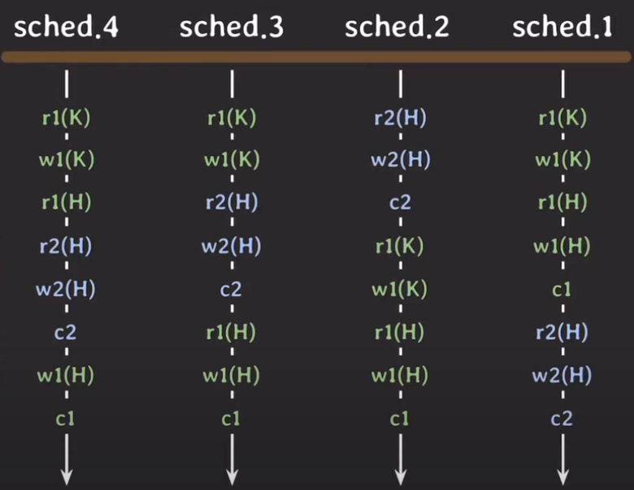
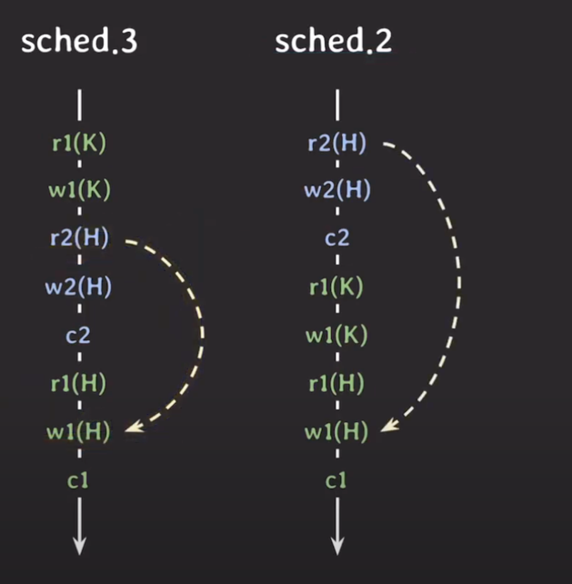
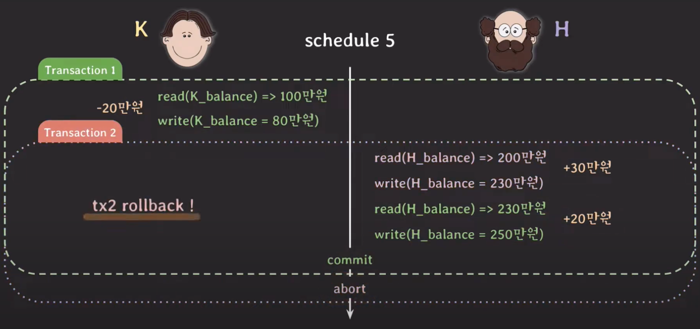
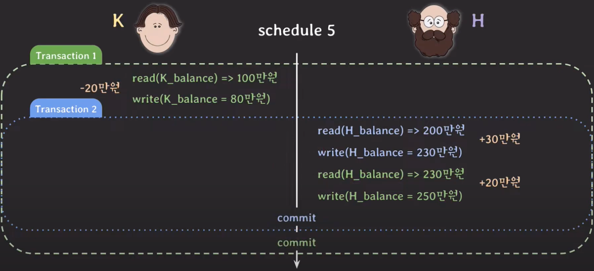
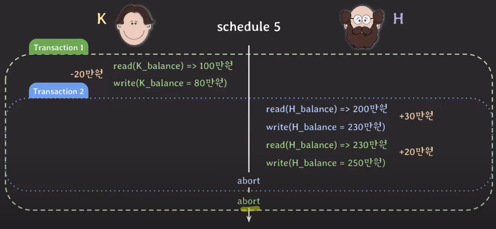
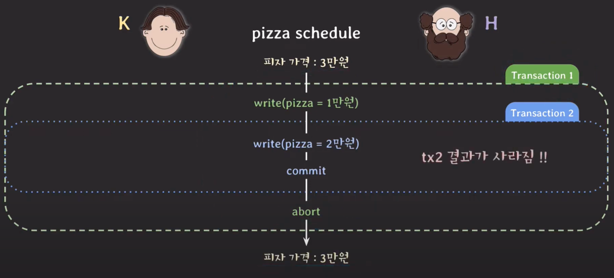
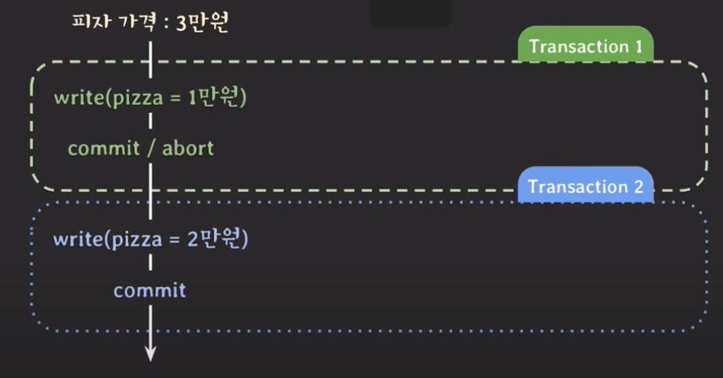

## Schedule
다음과 같이 여러 트랜잭션들이 동시에 실행될 때, 각 트랜잭션에 속한 operation들의 실행 순서를 **Schedule**이라고 한다.

여기서 중요한 점은 각 트랜잭션 내의 operation들의 순서는 바뀌지 않는다는 것이다.   
예를 들어, 첫 번째 트랜잭션의 순서는 K를 읽고 쓰고, H를 읽고 쓰고, 그 다음에 변경 내용을 commit하는 것이다. 이 순서는 항상 똑같다.  

### Serial schedule
schedule 2와 1처럼 트랜잭션들이 겹치지 않고 한 번에 하나씩 실행되는 schedule을 **Serial schedule**이라고 한다.   

하나의 트랜잭션이 데이터를 읽고 쓰는 I/O 작업을 수행하는 동안, CPU와 같은 다른 리소스는 대기 상태에 머물게 된다.   
이는 리소스 활용도가 매우 낮다는 것을 의미하며, 결국 시스템의 전반적인 처리 능력이 감소한다.    
따라서 serial schedule 방식을 사용하면 예상치 못한 결과를 마주하는 문제를 피할 수는 있지만, 성능이 좋지 않아 현실적으로 사용할 수 없다.

### Nonserial schedule
schedule 4와 3처럼 트랜잭션들이 겹쳐서 실행되는 schedule을 **Nonserial schedule**이라고 한다.

하나의 트랜잭션이 실행되는 동안, CPU는 대기하는 것이 아니라 또 다른 트랜잭션을 실행하기 때문에 동시성이 높아진다.   
따라서 같은 시간 동안 더 많은 트랜잭션들을 처리할 수 있어 상대적으로 성능이 좋다.   

하지만 트랜잭션들이 어떤 형태로 겹쳐서 실행되는지에 따라 이상한 결과가 나올 수 있다는 단점이 존재한다.

## Serializability
좋은 성능을 가진 nonserial schedule 방식을 사용하고 싶지만, 이 방식은 이상한 결과가 나올 수 있다는 문제가 존재한다.    
이를 해결하기위해 연구한 끝에 한 가지 아이디어가 고안되었는데, 이는 conflict serializable한 nonserial schedule을 허용하는 방식이다.   
즉, 여러 트랜잭션을 동시에 실행해도 schedule이 conflict serializable하도록(conflict serializability 특성을 가지도록) 보장하면 된다. 

### Conflict serializable이란?
어떤 schedule이 serial schedule과 conflict equivalent일 때를 conflict serializable하다고 한다.   
여기서 Conflict equivalent는 **두 schedule이 같은 트랜잭션을 가지면서, 모든 conflicting operation들의 순서가 양쪽 schedule 모두 동일한 경우**를 의미한다.   

예를 들어, schedule 3의 {r2(H) -> w1(H)} 쌍과 schedule 2의 {r2(H) -> w1(H)} 쌍의 순서는 양쪽 schedule 모두 동일하다. 
또한 나머지 conflicting opration들의 순서도 동일하므로 두 schedule은 conflict equivalent하다.   
최종적으로 schedule 3은 serial schedule인 schedule 2와 conflict equivalent하므로 conflict serializable하다.    

반면에 schedule 4는 schedule 2와 schedule 1 둘 다 비교했을 때 conflict equivalent하지 않기 때문에 conflict serializable하지 않다.

> #### Conflict of two oprations
> 아래 세 가지 조건을 모두 만족하면 두 operation들에 대해서 conflict하다고 할 수 있다.
> 
> 1. 서로 다른 트랜잭션에 소속되어 있다.
> 2. 같은 데이터에 접근한다.
> 3. 최소 하나는 write operation이다.

---

## Unrecoverable schedule
다음과 같이 schedule 내에서 commit된 트랜잭션이 rollback된 트랜잭션이 쓴 데이터(유효하지 않은 데이터)를 읽은 경우 이를 unrecoverable schedule이라고 한다.

Unrecoverable schedule의 경우 rollback을 해도 이전 상태로 회복 불가능할 수 있기 때문에 DBMS는 이런 schedule을 허용하면 안 된다.    
예를 들어, 트랜잭션 2를 rollback해도 100만원에서 80만원이 된 K의 잔액은 회복할 수 없기 때문에 데이터 불일치가 발생한다.   

---

## Recoverable schedule
schedule 내에서 그 어떤 트랜잭션도 자신이 읽은 데이터를 쓴 트랜잭션(의존하고 있는 트랜잭션)이 먼저 commit/rollback되기 전까지는 commit하지 않는 경우 이를 recoverable schedule이라고 한다.   

Recoverable schedule의 경우 rollback할 때 이전 상태로 온전히 돌아갈 수 있기 때문에 DBMS는 이런 schedule만 허용해야 한다.

### Cascadeless schedule
위에서 본 것처럼 하나의 트랜잭션(tx2)이 rollback하면 의존성이 있는 다른 트랜잭션(tx1)도 rollback해야 하는 것을 **cascading rollback**이라고 한다.   
그런데 이 cascading rollback은 여러 트랜잭션의 rollback이 연쇄적으로 일어나는 것이기 때문에 처리하는 비용이 많이 든다.     
이 문제를 해결하기 위해 고민한 끝에 "데이터를 쓴 트랜잭션이 commit/rollback한 뒤에 데이터를 읽는 schedule만 허용하자"라는 의견이 나오게 되었다.   

예를 들어 tx2에 문제가 생겨 rollback을 해도, 해당 트랜잭션에 의존하고 있는 트랜잭션이 없기 때문에 tx2만 rollback하면 된다. 그리고나서 tx1을 이어서 실행하고 commit하면 정상적인 결과가 나오게 된다.

 
이처럼 schedule 내에서 어떤 트랜잭션도 commit되지 않은 트랜잭션들이 쓴 데이터는 읽지 않는 경우 **cascadeless schedule**이라고 한다.

> #### cascadeless schedule에도 문제가 존재한다?
> 만약 H 사장님이 피자 가격을 3만원에서 2만원으로 내리려는데, K 직원도 피자 가격을 실수로 1만원으로 내린다면 어떻게 될까?   
> 
> 
> 
> 위 그림에서 commit되지 않은 tx1이 쓴 데이터를 읽지 않기 때문에 이 schedule도 cascadeless schedule이라고 할 수 있다.   
> 따라서 tx2는 commit되었지만 tx1에 문제가 생겨 rollback되었기 때문에 tx2의 결과도 함께 사라지는 것이다.   

### Strict schedule
cascadeless schedule의 문제를 해결하기 위해 보완한 schedule을 strict schedule이라고 한다.   
strict schedule의 경우 cascadeless schedule과 달리 schedule 내에서 어떤 트랜잭션도 commit되지 않은 트랜잭션들이 쓴 데이터는 쓰지도 읽지도 않는다.   

strict schedule은 rollback할 때 recovery가 쉽다. 트랜잭션 이전 상태로 돌려놓기만 하면 되기 때문이다.

tx1이 rollback되면 피자 가격은 3만원으로 돌아가고, 그 다음에 tx2가 실행되어 피자 가격은 2만원이 된다.

## 최종 정리
***concurrency control은 serializability와 recoverability를 제공하며, 이와 관련된 트랜잭션 속성이 바로 isolation이다.***
