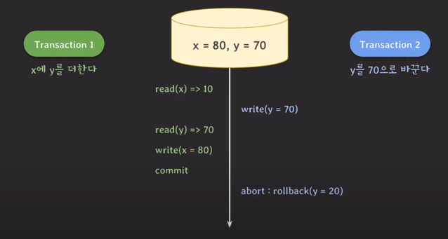
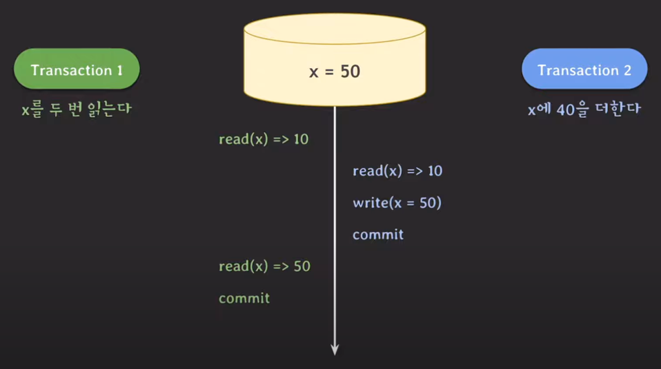
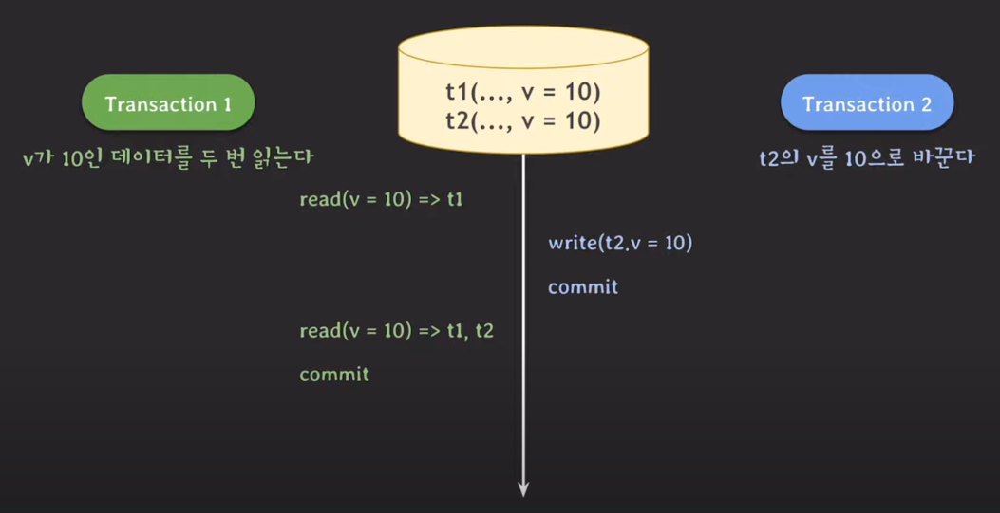
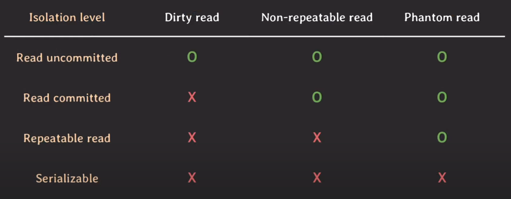
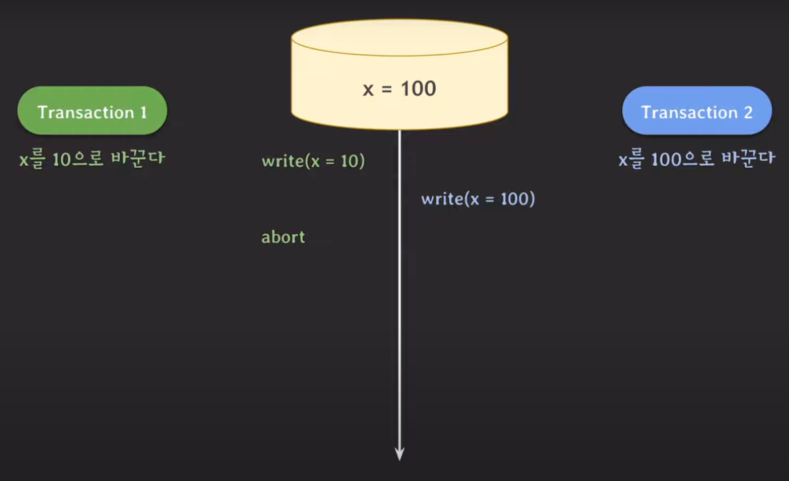
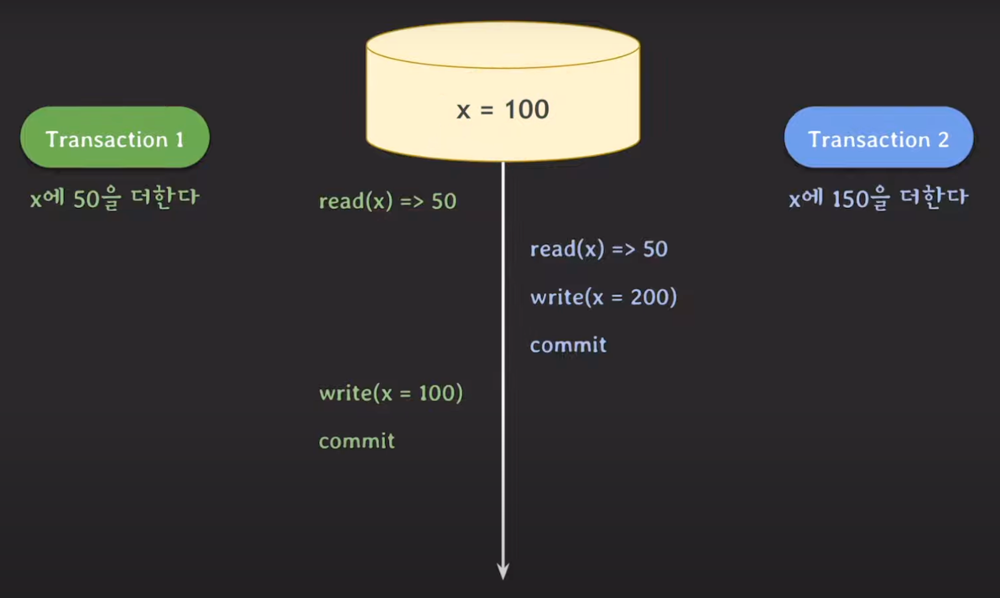
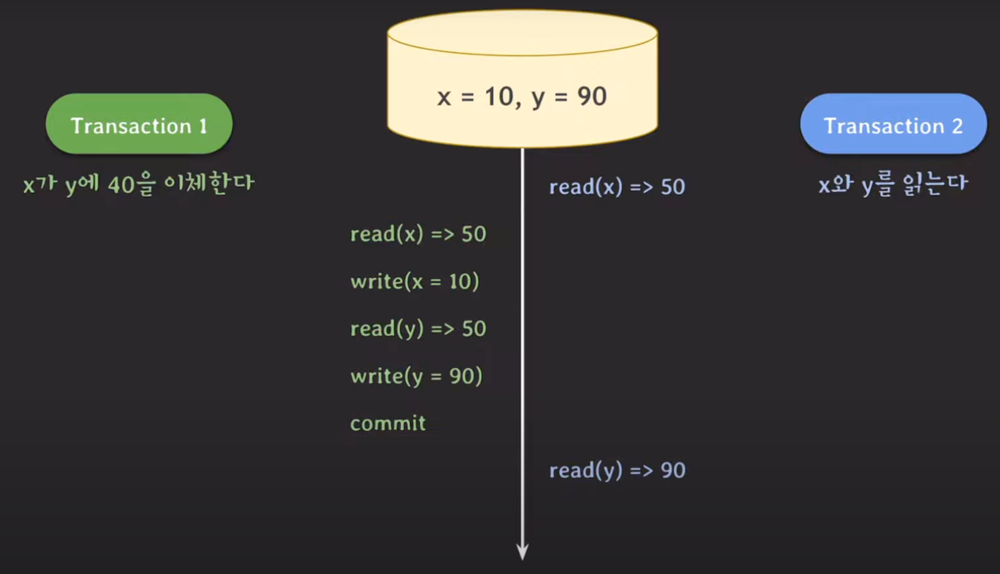
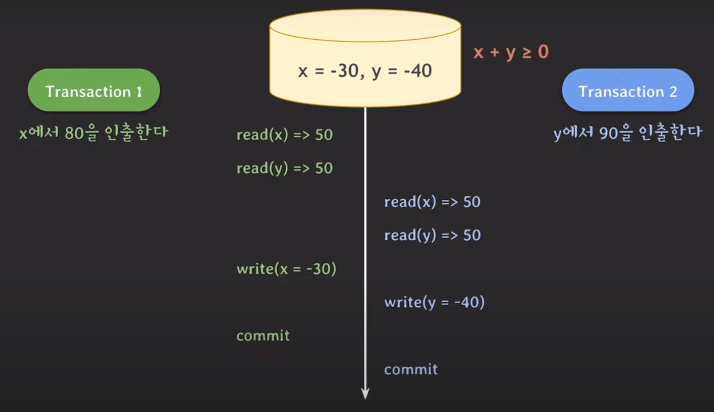
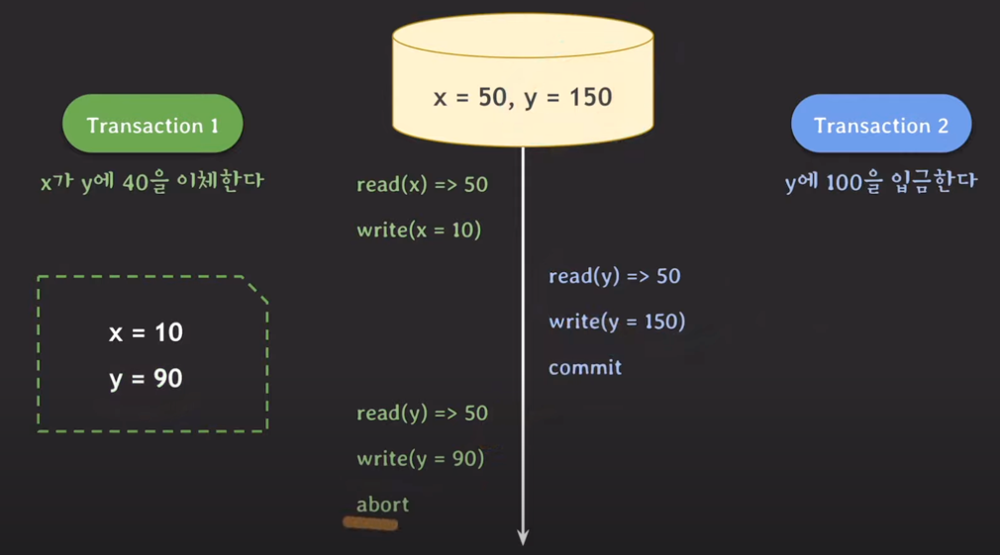

## 대표적인 이상 현상 3가지
여러 트랜잭션들이 동시에 실행되면 다양한 이상한 현상들이 발생할 수 있다.   
대표적으로 dirty read, non-repeatable read, phantom read 3가지가 존재한다.

### Dirty read
특정 트랜잭션에 의해 데이터가 변경되었지만 아직 commit되지 않은 상태에서 다른 트랜잭션이 해당 변경 사항을 조회할 때 발생할 수 있는 문제.

중요한 점은 꼭 앞에서 데이터를 수정한 트랜잭션이 rollback되어야지만 이 문제가 발생하는 것이 아니라, commit되지 않은 변경된 데이터를 조회하면 발생할 수 있는 문제라는 것이다. 

트랜잭션 B가 데이터를 변경하고 commit하지 않은 상태에서, 트랜잭션 A가 이어서 작업했는데 트랜잭션 B가 rollback되는 상황에서 이 문제는 치명적으로 다가온다.

### Non-repeatable read
같은 트랜잭션 내에서 같은 데이터를 n번 조회했을 때 읽어온 데이터가 다른 현상

### Phantom read
데이터를 조회할 때마다 그 결과가 다르게 나오는 현상 

---

## Isolation level
여러 이상 현상들이 모두 발생하지 않게 만들면 제약사항이 많아지는데, 그러면 동시 처리가 가능한 트랜잭션의 수가 감소해 DB의 성능이 떨어진다.
따라서 사용자가 임의로 이상 현상들 중에서 일부만 허용할 수 있도록 몇 가지 level을 제공하는데, 이것이 isolation level이다.

애플리케이션 설계자는 isolation level을 통해 전체 처리량과 데이터 일관성 사이에서 어느 정도 거래를 할 수 있다.

### Read uncommitted
- commit되지 않은 트랜잭션의 내용을 다른 트랜잭션이 조회하는 것을 허용한다.
  - dirty read, non-repeatable read, phantom read 모두 허용
- 데이터 무결성을 해칠 수는 있지만, 성능은 가장 빠르다는 장점이 존재한다.

### Read committed
- commit이 완료된 트랜잭션의 변경 사항만 다른 트랜잭션에서 조회할 수 있도록 허용한다.
  - non-repeatable read, phantom read 허용
- 트랜잭션 A에서 데이터가 변경되었지만 아직 commit되지 않은 상태에서, 트랜잭션 B가 해당 데이터를 조회할 경우 트랜잭션 A 시작 전의 데이터를 가져온다.   

### Repeatable read
- 특정 row를 조회할 때 항상 같은 데이터를 가져오는 것을 보장한다.
  - phantom read 허용
- row가 추가되는 것은 막지 못하기 때문에 phantom read 현상은 발생할 수 있다.
- MySQL의 InnoDB 엔진의 기본 격리 수준이 repeatable read다.

### Serializable
- 모든 이상 현상이 발생하지 않는 것을 보장한다.
- 가장 높은 데이터 정합성을 가지지만, 성능이 가장 떨어진다는 단점이 존재한다.

---

## 추가로 정의된 이상 현상들
ANSI/ISO standard SQL 92에서 정의한 논문에서는 아래 3가지 이유로 인해 isolation level을 비판하였다.   
1. 세 가지 이상 현상의 정의가 모호하다.
2. 이상 현상은 세 가지 외에도 더 존재한다.
3. 상업적인 DBMS에서 사용하는 방법을 반영해서 isolation level을 구분하지 않았다.

이러한 이유들로 인해 또 다른 이상 현상들을 추가로 정의했다.

### Dirty write
쓰기 연산을 수행하는 서로 다른 2개의 트랜잭션이 동시에 실행되었을 때, commit되지 않은 데이터를 다른 트랜잭션에서 write함으로써 발생할 수 있는 이상 현상.

예를 들어, x에 0이라는 데이터가 들어 있을 때 트랜잭션 A가 x를 10으로 바꾼다면 x는 10이 된다. 그 다음에 트랜잭션 B가 x를 100으로 바꾸면 x는 100이 된다.   
이때 트랜잭션 A를 commit하지 않고 rollback해버리면 x는 0이 되어 트랜잭션 B의 작업 내용이 무시될 수 있다.   
물론 트랜잭션 A를 commit해도, x에는 10이 아닌 100이라는 데이터가 저장되는 문제가 발생한다.   

***rollback 시 정상적인 recovery는 매우 중요하기 때문에 모든 isolation level에서 dirty write를 허용해서는 안 된다.*** 

### Lost update
서로 다른 트랜잭션이 겹쳐서 실행됨으로써 업데이트를 덮어 쓰게 되는 문제.

예를 들어, x에는 50이 있다고 했을 때 트랜잭션 A는 50을 더하고 B는 150을 더한다고 가정하자.   
트랜잭션 B에서 먼저 write 연산을 수행한 뒤 commit함으로써 x는 200이 된다.   
하지만 트랜잭션 A가 이어서 write 연산을 수행하고 commit하면 x는 100이 된다. 즉, 트랜잭션 B의 작업 내용은 날아가게 되는 것이다.

### Read skew
데이터를 조회했을 때, 그 데이터가 일관적이지 않은 이상 현상.

예를 들어 x, y에 각각 50이라는 값이 있을 때, 트랜잭션 A는 x가 y에 40을 이체하는 작업을 수행하고 트랜잭션 B는 x와 y를 조회하는 작업을 수행한다고 가정하자.   
먼저 트랜잭션 B가 실행되어 x를 읽으면 50을 가져오게 된다. 그리고나서 트랜잭션 A가 실행 및 commit되면 x는 10, y는 90이 된다.   
다음으로 트랜잭션 B가 이어서 y를 읽으면 그 값은 90이 되는데, 처음에 읽었던 x와 방금 읽은 y의 값을 더하면 140이 되어버린다.   
이는 처음에 x와 y를 더한 값 100과 일치하지 않기 때문에 데이터의 정합성이 깨졌다고 볼 수 있다.

### Write skew
서로 다른 트랜잭션이 서로 다른 데이터에 write 연산을 수행했음에도 데이터 불일치가 발생하는 이상 현상.

예를 들어 x와 y에 각각 50이 들어 있고, x+y는 0보다 크거나 같아야 하는 제약 조건이 있다고 가정하자.   
트랜잭션 A는 x에서 80을 차감하고, B는 y에서 90을 차감하는 작업을 수행한다.   
만약 트랜잭션 A가 x에서 80을 차감하면 x는 -30이 되며, x+y(20)는 여전히 0보다 크거나 같다.   
그리고나서 트랜잭션 B가 y에서 90을 차감하면 y는 -40이 되는데, 이러면 x+y(-70)는 0보다 작아지므로 제약 조건을 위반하게 된다.   
여기서 문제는 트랜잭션 A, B가 순차적으로 실행되었다면 B의 결과로 인해 rollback되었을텐데, 그렇지 않고 commit되었다는 것이다.

---

## Snapshot isolation
standard SQL 92에서는 "상업적인 DBMS에서 사용되는 방법을 반영해서 isolation level을 구분하지 않았다"라는 이유로, **Snapshot isolation**이라는 isolation level을 소개한다.   
snapshot isolation은 각 트랜잭션이 시작되는 시점에 스냅샷을 찍어서 다른 트랜잭션에 영향을 받지 않고 데이터를 조회할 수 있도록 해준다.   
여기서 중요한 점은, 서로 다른 2개의 트랜잭션이 모두 write 연산을 수행할 때 첫 번째로 commit된 트랜잭션에 의해서만 데이터가 수정된다는 것이다.

예를 들어 x와 y에 각각 50이 들어 있으며, 트랜잭션 A는 x가 y에 40을 이체하는 작업을 수행하고 B는 y에 100을 입금하는 작업을 수행한다고 가정해보자.   
트랜잭션 A가 시작되면 스냅샷을 찍는데, 여기에는 x=50과 y=50이라는 정보가 담겨 있게 된다. 이때 트랜잭션 A가 x를 10으로 변경하더라도 실제 DB에는 반영되지 않고, 스냅샷에 있는 x만 변경된다.   
트랜잭션 B가 시작되어 y에 100을 더한 뒤 commit하면, y는 150이 되는데, 이후에 트랜잭션 A가 y를 조회할 때는 150이 아닌 50을 가져온다. 이는 데이터를 스냅샷에서 읽어온다는 것을 의미한다.   
그렇게 가져온 y에 40을 더해 y는 90이 되지만, snapshot isolation의 경우 첫 번째로 commit된 트랜잭션만 DB에 반영되기 때문에 트랜잭션 A는 rollback된다.

## 실무에서 isolation level
주요 RDBMS는 SQL 표준에 기반해서 isolation level을 정의하지만, 이들마다 제공하는 isolation level이 모두 다르다.   
또한, 같은 이름의 isolation level이라도 동작 방식이 다를 수 있다.

따라서 우리는 공식 문서를 통해 사용하는 RDBMS의 isolation level을 잘 파악해서 적절한 isolation level을 사용할 수 있어야 한다.

